# AIAgentX Architecture Documentation

## Overview

AIAgentX follows **Clean Architecture** and **Domain-Driven Design (DDD)** principles to create a maintainable, testable, and scalable AI agent orchestration platform. The architecture enforces strict dependency inversion, keeping business logic independent of frameworks and external concerns.

## Architectural Principles

### Clean Architecture Layers

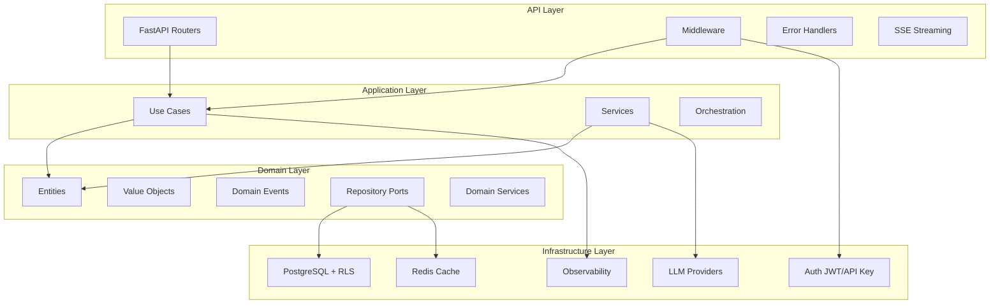

### Dependency Rule

**Dependencies must only point inward.** The outer layers can depend on inner layers, but inner layers must never depend on outer layers.

- **Domain Layer:** Zero dependencies on other layers
- **Application Layer:** Depends only on Domain Layer
- **API Layer:** Depends on Application and Domain Layers
- **Infrastructure Layer:** Implements interfaces defined in Domain Layer

## Domain-Driven Design Implementation

### Aggregates and Aggregate Roots

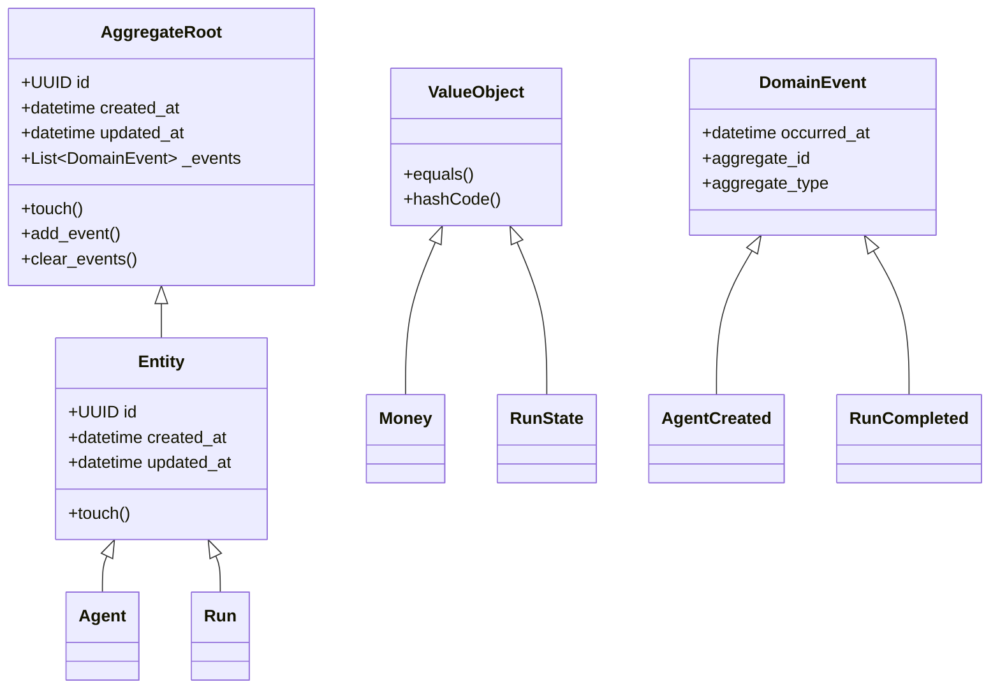

### Core Aggregates

#### Agent Aggregate
- **Aggregate Root:** `Agent`
- **Entities:** `AgentVersion`, `ToolGrant`
- **Value Objects:** `AgentStatus`, `ModelPolicy`
- **Domain Events:** `AgentCreated`, `AgentVersionCreated`, `AgentPublished`, `AgentDeleted`

#### Run Aggregate
- **Aggregate Root:** `Run`
- **Entities:** `RunStep`
- **Value Objects:** `RunState`, `Money`, `TokenUsage`
- **Domain Events:** `RunCreated`, `RunStateChanged`, `RunCompleted`, `RunFailed`, `RunCancelled`

#### Memory Aggregate
- **Aggregate Root:** `MemoryAggregate`
- **Entities:** `MemoryRecord`, `SessionSummary`, `MemoryRetentionPolicy`
- **Value Objects:** `MemoryScope`, `AllowedUseLabel`
- **Domain Events:** `MemoryWritten`, `MemoryRetrieved`

## Component Architecture

### System Component Diagram

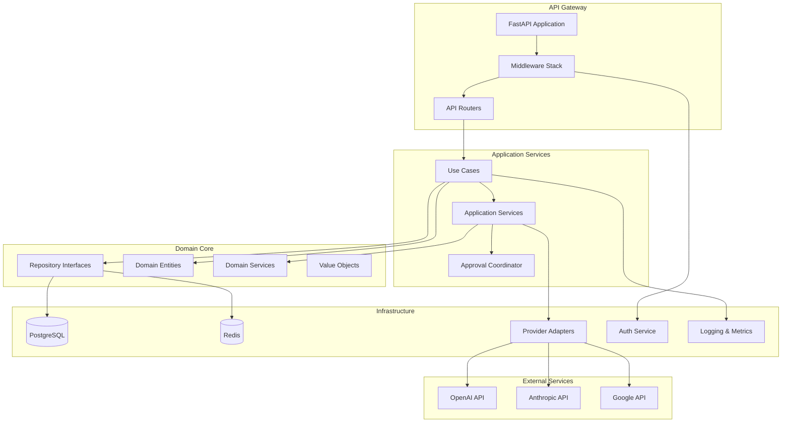

### Repository Pattern Implementation

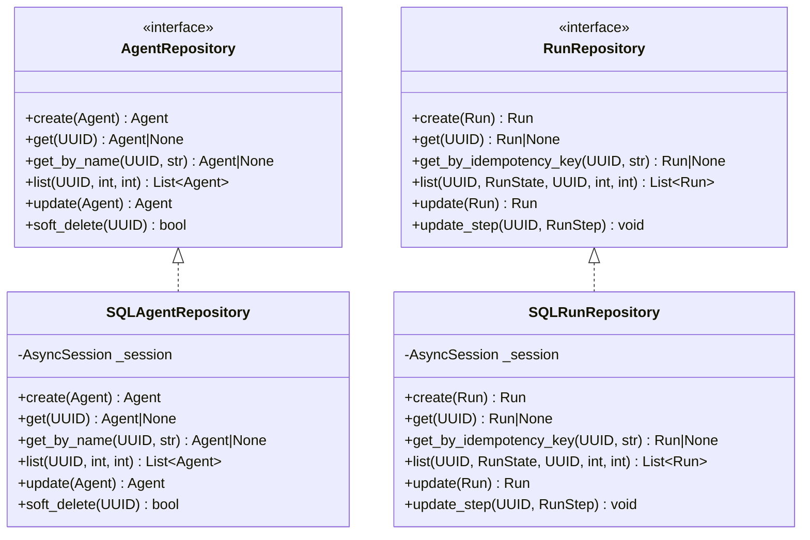

## Event-Driven Architecture

### Outbox Pattern

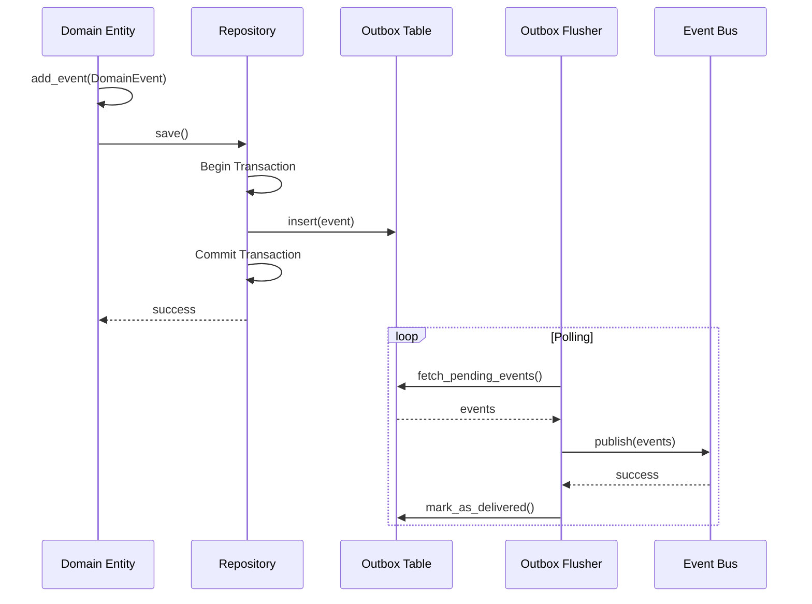

### Domain Events Flow

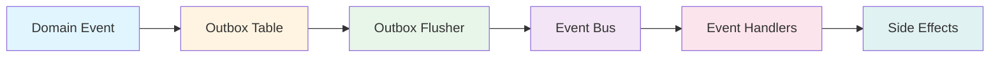

## Multi-Tenant Architecture

### Tenant Isolation Strategy

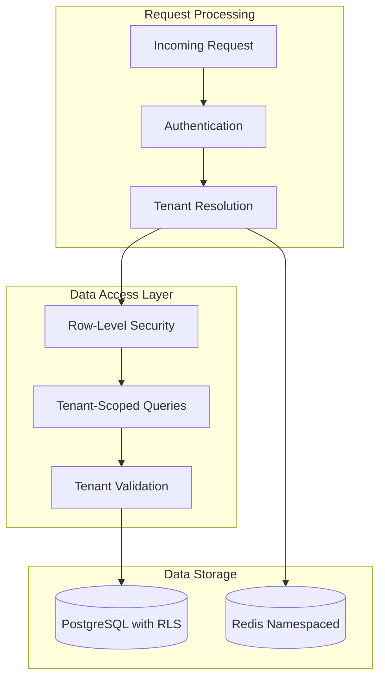

### Row-Level Security (RLS) Implementation

AIAgentX uses PostgreSQL's Row-Level Security to enforce tenant isolation at the database level:

```sql
-- Example RLS Policy
CREATE POLICY tenant_isolation ON agents
    FOR ALL
    TO aiagentx_app
    USING (tenant_id = current_setting('app.current_tenant_id')::uuid);
```

## CQRS Implementation

### Command Query Separation

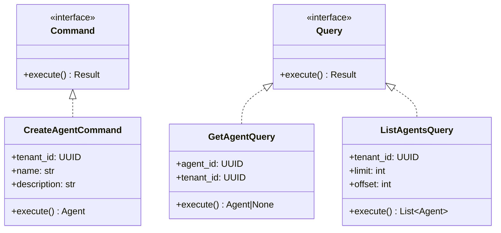

## Service Layer Architecture

### Application Services

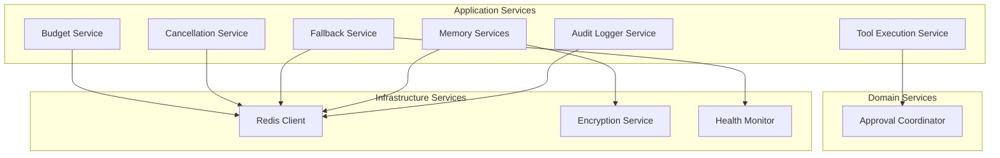

## Dependency Injection

### Service Composition

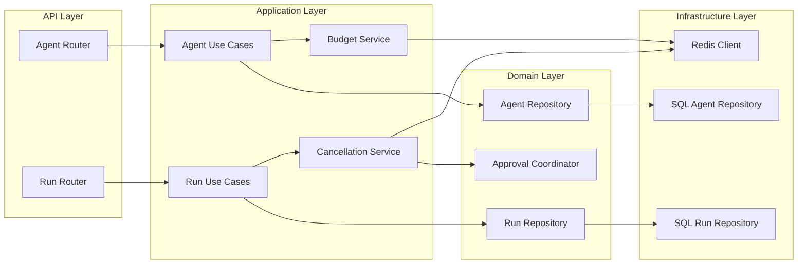

## Performance Architecture

### Caching Strategy

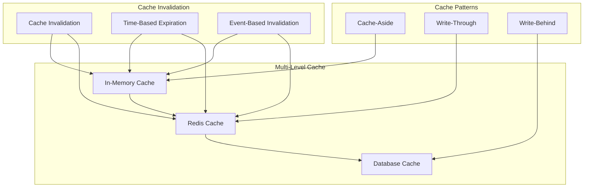

## Scalability Architecture

### Horizontal Scaling Strategy

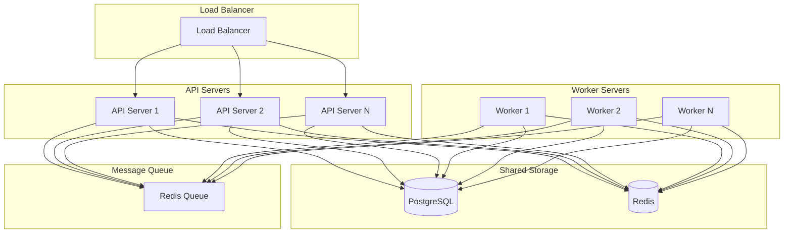

## Observability Architecture

### Monitoring and Tracing

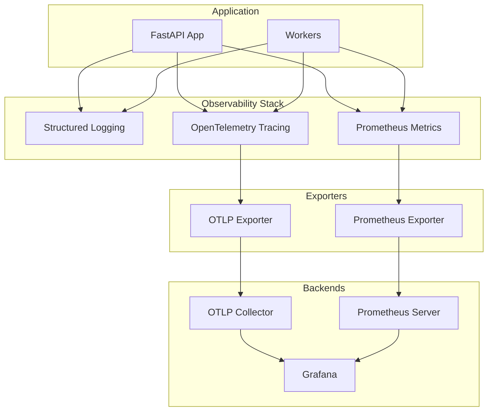

## Error Handling Architecture

### Error Propagation Flow

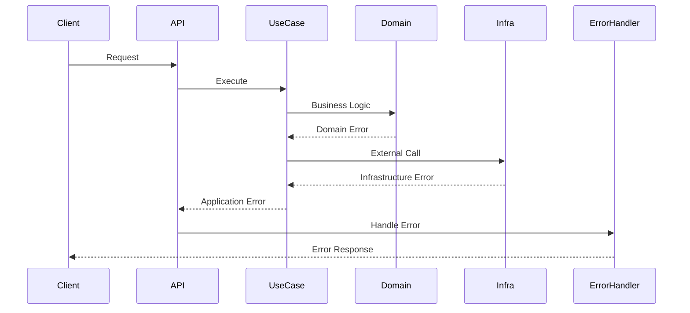

### Exception Hierarchy

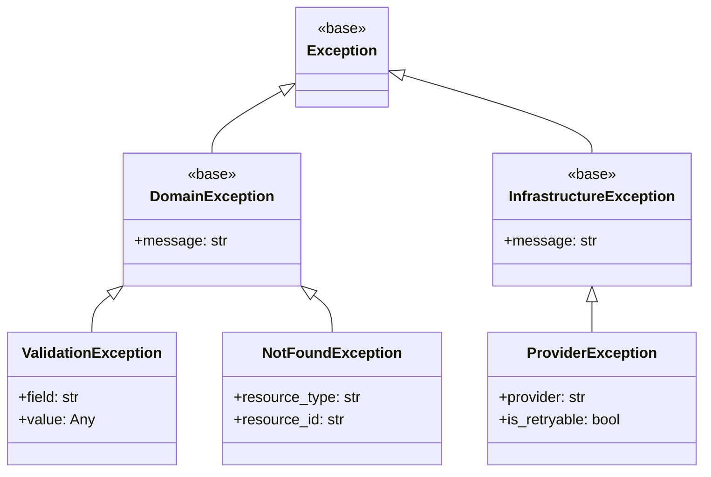

## Security Architecture

### Authentication Flow

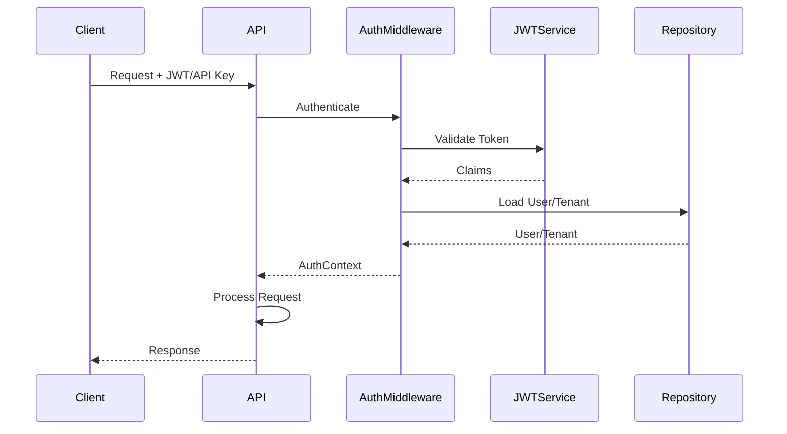

### Authorization Model

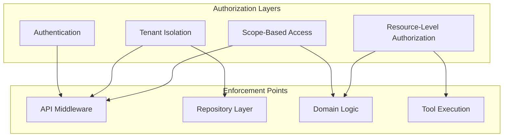

## Technology Stack

### Core Technologies

| Layer | Technology | Purpose |
|-------|-----------|---------|
| **API Framework** | FastAPI 0.115+ | High-performance async web framework |
| **Database** | PostgreSQL 16+ | Primary data storage with RLS |
| **Cache** | Redis 7+ | Caching and session storage |
| **ORM** | SQLAlchemy 2.0+ | Database abstraction |
| **Async Driver** | AsyncPG | PostgreSQL async driver |
| **Task Queue** | Dramatiq | Background job processing |
| **LLM Providers** | OpenAI, Anthropic, Google | AI model integration |
| **Authentication** | JWT, PyJWT | Token-based authentication |
| **Logging** | Structlog | Structured JSON logging |
| **Tracing** | OpenTelemetry | Distributed tracing |
| **Metrics** | Prometheus | Metrics collection |
| **Testing** | Pytest | Testing framework |
| **Type Checking** | MyPy | Static type analysis |

### Infrastructure Technologies

| Component | Technology | Purpose |
|-----------|-----------|---------|
| **Containerization** | Docker | Application containerization |
| **Orchestration** | Kubernetes | Container orchestration |
| **Proxy** | Nginx/Ingress | Reverse proxy and load balancing |
| **Monitoring** | Grafana | Visualization and dashboards |
| **Alerting** | Prometheus Alertmanager | Alert management |
| **Log Aggregation** | Loki/Elasticsearch | Log collection and analysis |

## Deployment Architecture

### Container Architecture

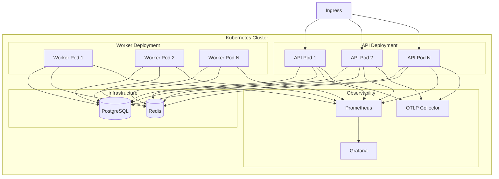

## Architecture Decision Records

### Key Architectural Decisions

1. **Clean Architecture over Layered Architecture**
   - **Reason:** Better testability and maintainability
   - **Trade-off:** More boilerplate code initially

2. **PostgreSQL RLS over Application-Level Isolation**
   - **Reason:** Database-level security guarantees
   - **Trade-off:** Vendor lock-in to PostgreSQL

3. **Redis over In-Memory Caching**
   - **Reason:** Distributed caching and persistence
   - **Trade-off:** Additional infrastructure dependency

4. **SSE over WebSocket for Streaming**
   - **Reason:** Simpler implementation, HTTP-friendly
   - **Trade-off:** One-way communication only

5. **Outbox Pattern over Direct Event Publishing**
   - **Reason:** Reliable event delivery
   - **Trade-off:** Eventual consistency

6. **Multi-Provider Abstraction over Single Provider**
   - **Reason:** Vendor independence and fallback capability
   - **Trade-off:** Increased complexity

## Future Architecture Considerations

### Scalability Enhancements
- **Read Replicas:** For scaling read operations
- **Connection Pooling:** Advanced pooling strategies
- **Database Sharding:** For multi-tenant scaling at scale

### Performance Optimizations
- **Query Optimization:** Advanced indexing strategies
- **Materialized Views:** For complex queries
- **Edge Computing:** CDN integration for static assets

### Architecture Evolution
- **Microservices:** Potential split into focused services
- **Event Sourcing:** For complex domain requirements
- **CQRS Enhancement:** Separate read/write models

This architecture documentation provides a comprehensive view of the AIAgentX system architecture, emphasizing clean design principles, domain-driven modeling, and enterprise-grade patterns.