# AIAgentX Data Flow Documentation

## Overview

This document provides comprehensive data flow diagrams and sequence diagrams for all major operations in the AIAgentX system. These flows illustrate how data moves through the architecture layers and components.

## Agent Creation and Versioning Flow

### Agent Creation Sequence Diagram

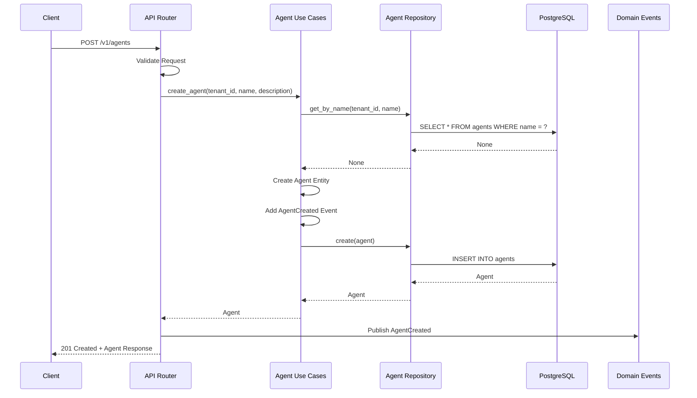
```mermaid
sequenceDiagram
    participant Client
    participant API as API Router
    participant UC as Agent Use Cases
    participant Repo as Agent Repository
    participant DB as PostgreSQL
    participant Events as Domain Events
    
    Client->>API: POST /v1/agents
    API->>API: Validate Request
    API->>UC: create_agent(tenant_id, name, description)
    UC->>Repo: get_by_name(tenant_id, name)
    Repo->>DB: SELECT * FROM agents WHERE name = ?
    DB-->>Repo: None
    Repo-->>UC: None
    UC->>UC: Create Agent Entity
    UC->>UC: Add AgentCreated Event
    UC->>Repo: create(agent)
    Repo->>DB: INSERT INTO agents
    DB-->>Repo: Agent
    Repo-->>UC: Agent
    UC-->>API: Agent
    API->>Events: Publish AgentCreated
    API-->>Client: 201 Created + Agent Response
```

### Agent Version Publishing Flow

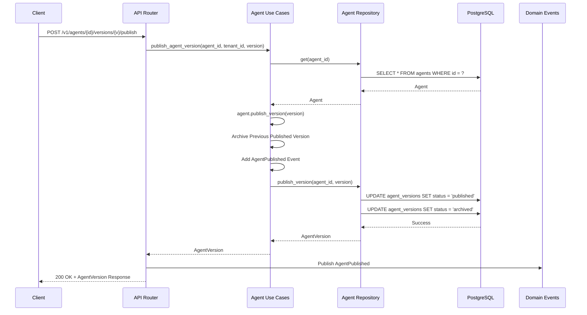
```mermaid
sequenceDiagram
    participant Client
    participant API as API Router
    participant UC as Agent Use Cases
    participant Repo as Agent Repository
    participant DB as PostgreSQL
    participant Events as Domain Events
    
    Client->>API: POST /v1/agents/{id}/versions/{v}/publish
    API->>UC: publish_agent_version(agent_id, tenant_id, version)
    UC->>Repo: get(agent_id)
    Repo->>DB: SELECT * FROM agents WHERE id = ?
    DB-->>Repo: Agent
    Repo-->>UC: Agent
    UC->>UC: agent.publish_version(version)
    UC->>UC: Archive Previous Published Version
    UC->>UC: Add AgentPublished Event
    UC->>Repo: publish_version(agent_id, version)
    Repo->>DB: UPDATE agent_versions SET status = 'published'
    Repo->>DB: UPDATE agent_versions SET status = 'archived'
    DB-->>Repo: Success
    Repo-->>UC: AgentVersion
    UC-->>API: AgentVersion
    API->>Events: Publish AgentPublished
    API-->>Client: 200 OK + AgentVersion Response
```

## Agent Execution Flow

### Run Creation and Execution Flow

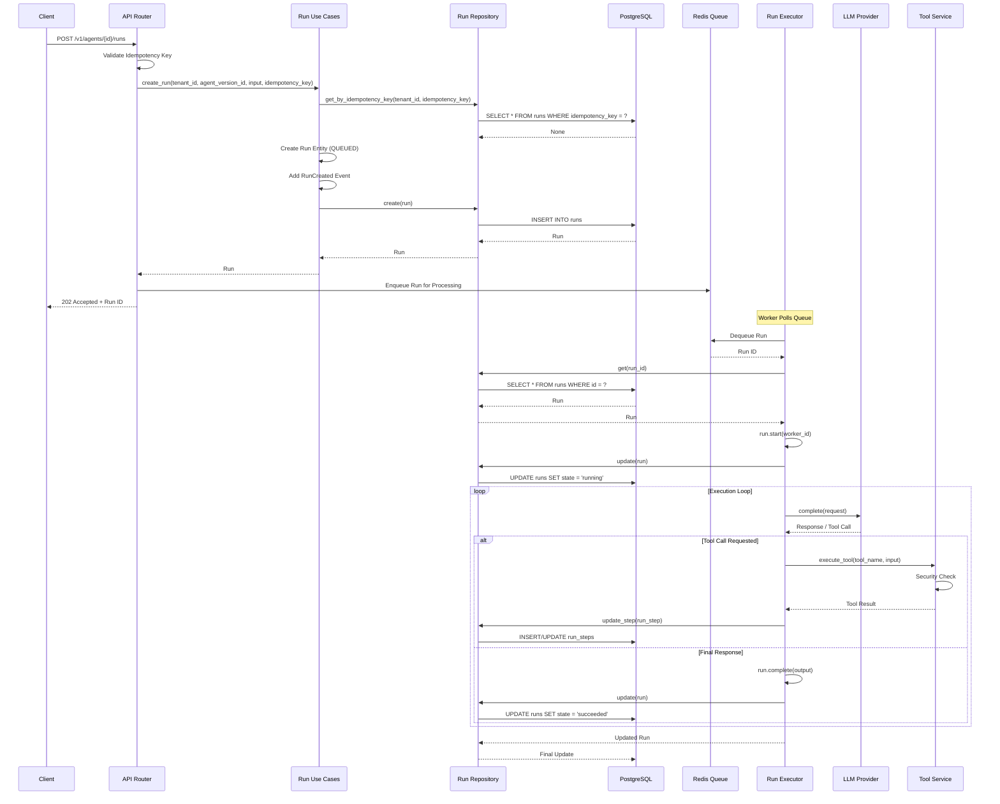
```mermaid
sequenceDiagram
    participant Client
    participant API as API Router
    participant UC as Run Use Cases
    participant Repo as Run Repository
    participant DB as PostgreSQL
    participant Queue as Redis Queue
    participant Worker as Run Executor
    participant Provider as LLM Provider
    participant Tools as Tool Service
    
    Client->>API: POST /v1/agents/{id}/runs
    API->>API: Validate Idempotency Key
    API->>UC: create_run(tenant_id, agent_version_id, input, idempotency_key)
    UC->>Repo: get_by_idempotency_key(tenant_id, idempotency_key)
    Repo->>DB: SELECT * FROM runs WHERE idempotency_key = ?
    DB-->>Repo: None
    UC->>UC: Create Run Entity (QUEUED)
    UC->>UC: Add RunCreated Event
    UC->>Repo: create(run)
    Repo->>DB: INSERT INTO runs
    DB-->>Repo: Run
    Repo-->>UC: Run
    UC-->>API: Run
    API->>Queue: Enqueue Run for Processing
    API-->>Client: 202 Accepted + Run ID
    
    Note over Worker: Worker Polls Queue
    Worker->>Queue: Dequeue Run
    Queue-->>Worker: Run ID
    Worker->>Repo: get(run_id)
    Repo->>DB: SELECT * FROM runs WHERE id = ?
    DB-->>Repo: Run
    Repo-->>Worker: Run
    Worker->>Worker: run.start(worker_id)
    Worker->>Repo: update(run)
    Repo->>DB: UPDATE runs SET state = 'running'
    
    loop Execution Loop
        Worker->>Provider: complete(request)
        Provider-->>Worker: Response / Tool Call
        alt Tool Call Requested
            Worker->>Tools: execute_tool(tool_name, input)
            Tools->>Tools: Security Check
            Tools-->>Worker: Tool Result
            Worker->>Repo: update_step(run_step)
            Repo->>DB: INSERT/UPDATE run_steps
        else Final Response
            Worker->>Worker: run.complete(output)
            Worker->>Repo: update(run)
            Repo->>DB: UPDATE runs SET state = 'succeeded'
        end
    end
    
    Worker-->>Repo: Updated Run
    Repo-->>DB: Final Update
```

### Run State Machine

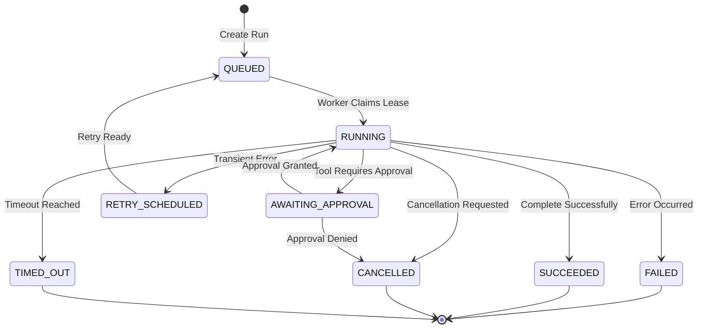
```mermaid
stateDiagram-v2
    [*] --> QUEUED: Create Run
    QUEUED --> RUNNING: Worker Claims Lease
    RUNNING --> SUCCEEDED: Complete Successfully
    RUNNING --> FAILED: Error Occurred
    RUNNING --> AWAITING_APPROVAL: Tool Requires Approval
    RUNNING --> CANCELLED: Cancellation Requested
    RUNNING --> TIMED_OUT: Timeout Reached
    RUNNING --> RETRY_SCHEDULED: Transient Error
    AWAITING_APPROVAL --> RUNNING: Approval Granted
    AWAITING_APPROVAL --> CANCELLED: Approval Denied
    RETRY_SCHEDULED --> QUEUED: Retry Ready
    FAILED --> [*]
    SUCCEEDED --> [*]
    CANCELLED --> [*]
    TIMED_OUT --> [*]
```

## Tool Execution Flow

### Tool Execution with Security

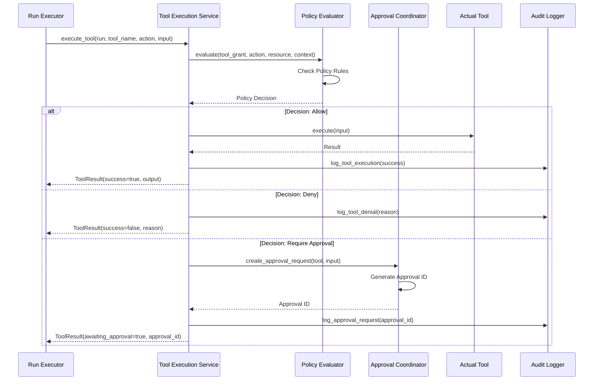
```mermaid
sequenceDiagram
    participant Worker as Run Executor
    participant ToolService as Tool Execution Service
    participant Policy as Policy Evaluator
    participant Approvals as Approval Coordinator
    participant Tool as Actual Tool
    participant Audit as Audit Logger
    
    Worker->>ToolService: execute_tool(run, tool_name, action, input)
    ToolService->>Policy: evaluate(tool_grant, action, resource, context)
    Policy->>Policy: Check Policy Rules
    Policy-->>ToolService: Policy Decision
    
    alt Decision: Allow
        ToolService->>Tool: execute(input)
        Tool-->>ToolService: Result
        ToolService->>Audit: log_tool_execution(success)
        ToolService-->>Worker: ToolResult(success=true, output)
    else Decision: Deny
        ToolService->>Audit: log_tool_denial(reason)
        ToolService-->>Worker: ToolResult(success=false, reason)
    else Decision: Require Approval
        ToolService->>Approvals: create_approval_request(tool, input)
        Approvals->>Approvals: Generate Approval ID
        Approvals-->>ToolService: Approval ID
        ToolService->>Audit: log_approval_request(approval_id)
        ToolService-->>Worker: ToolResult(awaiting_approval=true, approval_id)
    end
```

### Tool Approval Workflow

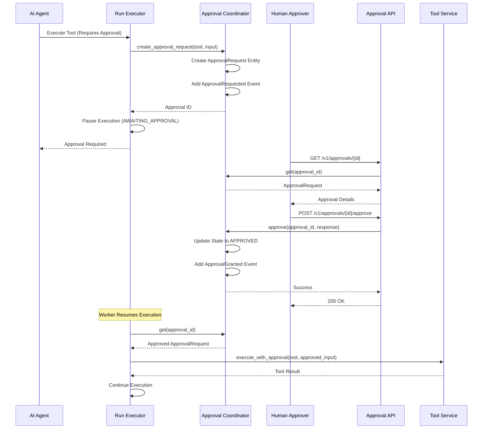
```mermaid
sequenceDiagram
    participant Agent as AI Agent
    participant Worker as Run Executor
    participant Approvals as Approval Coordinator
    participant User as Human Approver
    participant API as Approval API
    participant Tool as Tool Service
    
    Agent->>Worker: Execute Tool (Requires Approval)
    Worker->>Approvals: create_approval_request(tool, input)
    Approvals->>Approvals: Create ApprovalRequest Entity
    Approvals->>Approvals: Add ApprovalRequested Event
    Approvals-->>Worker: Approval ID
    Worker->>Worker: Pause Execution (AWAITING_APPROVAL)
    Worker-->>Agent: Approval Required
    
    User->>API: GET /v1/approvals/{id}
    API->>Approvals: get(approval_id)
    Approvals-->>API: ApprovalRequest
    API-->>User: Approval Details
    
    User->>API: POST /v1/approvals/{id}/approve
    API->>Approvals: approve(approval_id, response)
    Approvals->>Approvals: Update State to APPROVED
    Approvals->>Approvals: Add ApprovalGranted Event
    Approvals-->>API: Success
    API-->>User: 200 OK
    
    Note over Worker: Worker Resumes Execution
    Worker->>Approvals: get(approval_id)
    Approvals-->>Worker: Approved ApprovalRequest
    Worker->>Tool: execute_with_approval(tool, approved_input)
    Tool-->>Worker: Tool Result
    Worker->>Worker: Continue Execution
```

## Memory Operations Flow

### Memory Write Flow

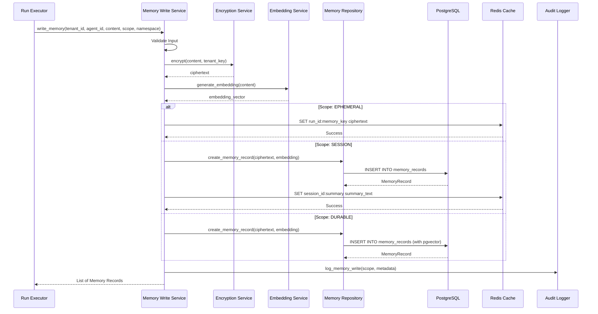
```mermaid
sequenceDiagram
    participant Worker as Run Executor
    participant MemoryService as Memory Write Service
    participant Encryption as Encryption Service
    participant Embeddings as Embedding Service
    participant Repo as Memory Repository
    participant DB as PostgreSQL
    participant Redis as Redis Cache
    participant Audit as Audit Logger
    
    Worker->>MemoryService: write_memory(tenant_id, agent_id, content, scope, namespace)
    MemoryService->>MemoryService: Validate Input
    MemoryService->>Encryption: encrypt(content, tenant_key)
    Encryption-->>MemoryService: ciphertext
    MemoryService->>Embeddings: generate_embedding(content)
    Embeddings-->>MemoryService: embedding_vector
    
    alt Scope: EPHEMERAL
        MemoryService->>Redis: SET run_id:memory_key ciphertext
        Redis-->>MemoryService: Success
    else Scope: SESSION
        MemoryService->>Repo: create_memory_record(ciphertext, embedding)
        Repo->>DB: INSERT INTO memory_records
        DB-->>Repo: MemoryRecord
        MemoryService->>Redis: SET session_id:summary summary_text
        Redis-->>MemoryService: Success
    else Scope: DURABLE
        MemoryService->>Repo: create_memory_record(ciphertext, embedding)
        Repo->>DB: INSERT INTO memory_records (with pgvector)
        DB-->>Repo: MemoryRecord
    end
    
    MemoryService->>Audit: log_memory_write(scope, metadata)
    MemoryService-->>Worker: List of Memory Records
```

### Memory Retrieval Flow

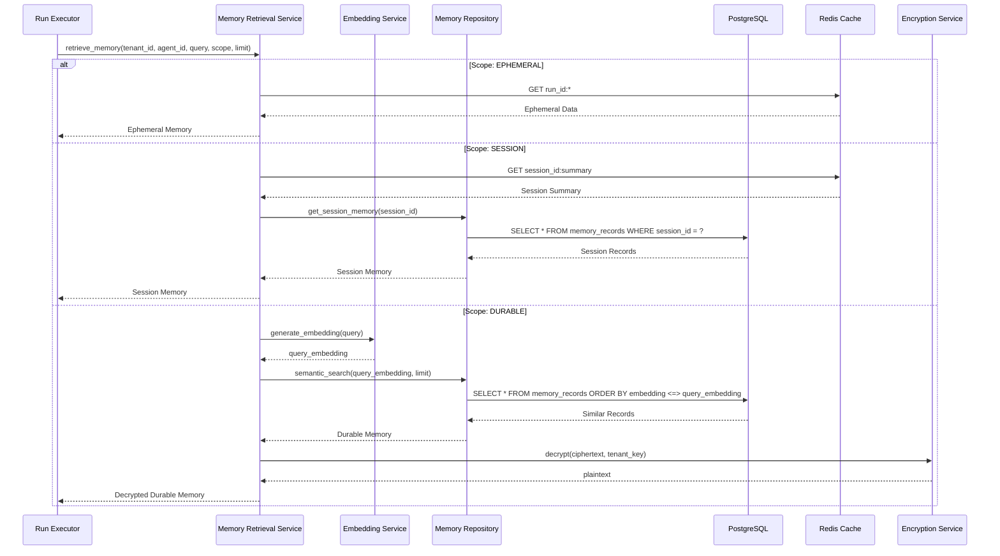
```mermaid
sequenceDiagram
    participant Worker as Run Executor
    participant MemoryService as Memory Retrieval Service
    participant Embeddings as Embedding Service
    participant Repo as Memory Repository
    participant DB as PostgreSQL
    participant Redis as Redis Cache
    participant Encryption as Encryption Service
    
    Worker->>MemoryService: retrieve_memory(tenant_id, agent_id, query, scope, limit)
    
    alt Scope: EPHEMERAL
        MemoryService->>Redis: GET run_id:*
        Redis-->>MemoryService: Ephemeral Data
        MemoryService-->>Worker: Ephemeral Memory
    else Scope: SESSION
        MemoryService->>Redis: GET session_id:summary
        Redis-->>MemoryService: Session Summary
        MemoryService->>Repo: get_session_memory(session_id)
        Repo->>DB: SELECT * FROM memory_records WHERE session_id = ?
        DB-->>Repo: Session Records
        Repo-->>MemoryService: Session Memory
        MemoryService-->>Worker: Session Memory
    else Scope: DURABLE
        MemoryService->>Embeddings: generate_embedding(query)
        Embeddings-->>MemoryService: query_embedding
        MemoryService->>Repo: semantic_search(query_embedding, limit)
        Repo->>DB: SELECT * FROM memory_records ORDER BY embedding <=> query_embedding
        DB-->>Repo: Similar Records
        Repo-->>MemoryService: Durable Memory
        MemoryService->>Encryption: decrypt(ciphertext, tenant_key)
        Encryption-->>MemoryService: plaintext
        MemoryService-->>Worker: Decrypted Durable Memory
    end
```

## Authentication and Authorization Flow

### JWT Authentication Flow

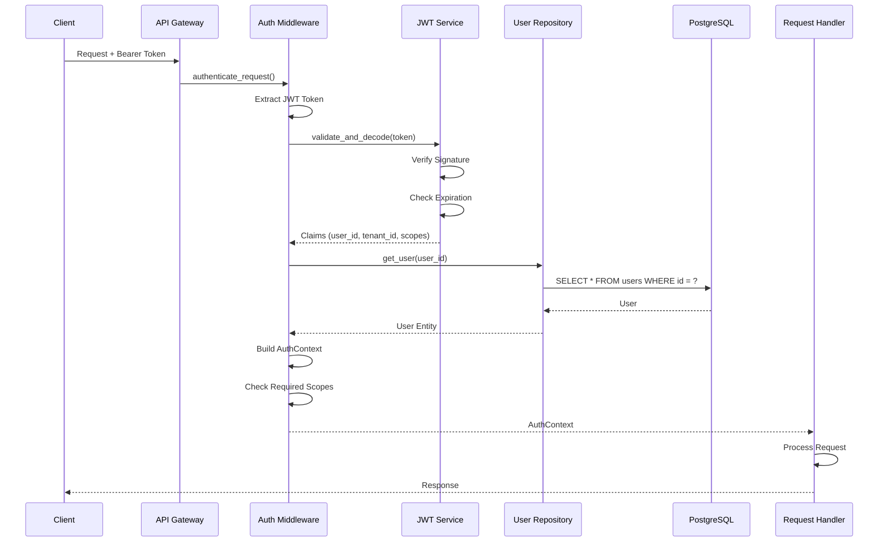
```mermaid
sequenceDiagram
    participant Client
    participant API as API Gateway
    participant Auth as Auth Middleware
    participant JWT as JWT Service
    participant Repo as User Repository
    participant DB as PostgreSQL
    participant Handler as Request Handler
    
    Client->>API: Request + Bearer Token
    API->>Auth: authenticate_request()
    Auth->>Auth: Extract JWT Token
    Auth->>JWT: validate_and_decode(token)
    JWT->>JWT: Verify Signature
    JWT->>JWT: Check Expiration
    JWT-->>Auth: Claims (user_id, tenant_id, scopes)
    Auth->>Repo: get_user(user_id)
    Repo->>DB: SELECT * FROM users WHERE id = ?
    DB-->>Repo: User
    Repo-->>Auth: User Entity
    Auth->>Auth: Build AuthContext
    Auth->>Auth: Check Required Scopes
    Auth-->>Handler: AuthContext
    Handler->>Handler: Process Request
    Handler-->>Client: Response
```

### API Key Authentication Flow

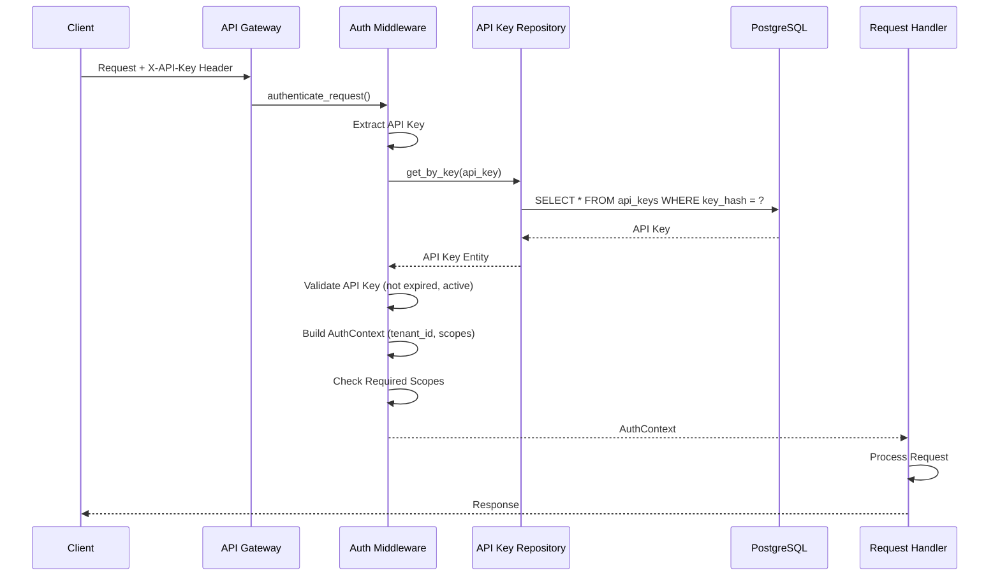
```mermaid
sequenceDiagram
    participant Client
    participant API as API Gateway
    participant Auth as Auth Middleware
    participant Repo as API Key Repository
    participant DB as PostgreSQL
    participant Handler as Request Handler
    
    Client->>API: Request + X-API-Key Header
    API->>Auth: authenticate_request()
    Auth->>Auth: Extract API Key
    Auth->>Repo: get_by_key(api_key)
    Repo->>DB: SELECT * FROM api_keys WHERE key_hash = ?
    DB-->>Repo: API Key
    Repo-->>Auth: API Key Entity
    Auth->>Auth: Validate API Key (not expired, active)
    Auth->>Auth: Build AuthContext (tenant_id, scopes)
    Auth->>Auth: Check Required Scopes
    Auth-->>Handler: AuthContext
    Handler->>Handler: Process Request
    Handler-->>Client: Response
```

## Provider Call Flow

### Provider Call with Fallback and Circuit Breaking

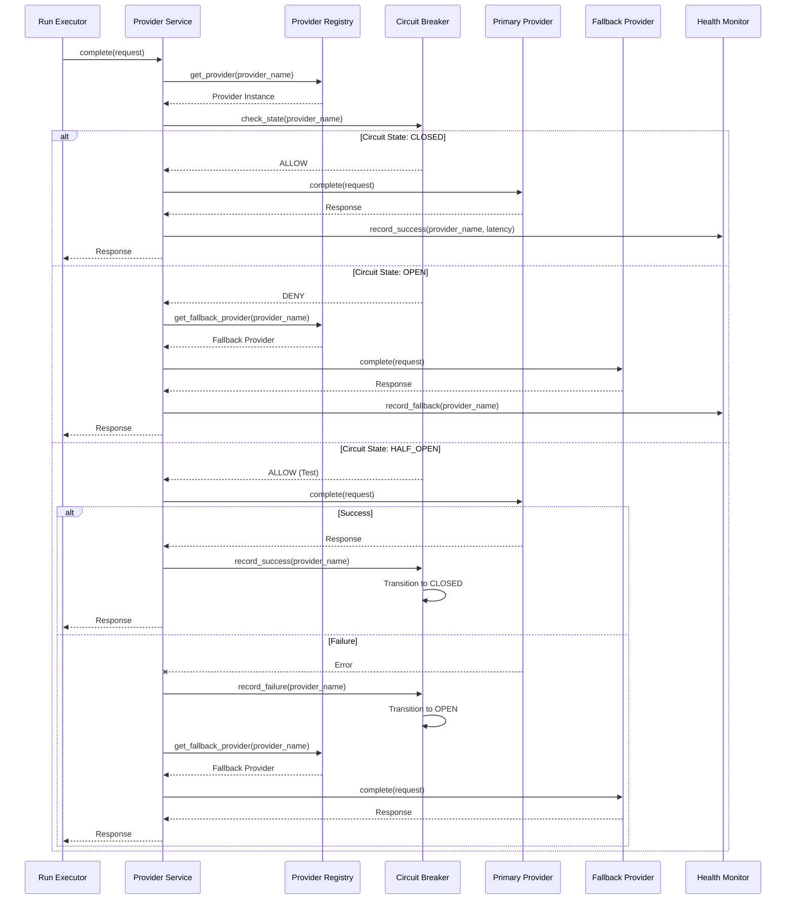
```mermaid
sequenceDiagram
    participant Worker as Run Executor
    participant ProviderService as Provider Service
    participant Registry as Provider Registry
    participant Circuit as Circuit Breaker
    participant Primary as Primary Provider
    participant Fallback as Fallback Provider
    participant Monitor as Health Monitor
    
    Worker->>ProviderService: complete(request)
    ProviderService->>Registry: get_provider(provider_name)
    Registry-->>ProviderService: Provider Instance
    ProviderService->>Circuit: check_state(provider_name)
    
    alt Circuit State: CLOSED
        Circuit-->>ProviderService: ALLOW
        ProviderService->>Primary: complete(request)
        Primary-->>ProviderService: Response
        ProviderService->>Monitor: record_success(provider_name, latency)
        ProviderService-->>Worker: Response
    else Circuit State: OPEN
        Circuit-->>ProviderService: DENY
        ProviderService->>Registry: get_fallback_provider(provider_name)
        Registry-->>ProviderService: Fallback Provider
        ProviderService->>Fallback: complete(request)
        Fallback-->>ProviderService: Response
        ProviderService->>Monitor: record_fallback(provider_name)
        ProviderService-->>Worker: Response
    else Circuit State: HALF_OPEN
        Circuit-->>ProviderService: ALLOW (Test)
        ProviderService->>Primary: complete(request)
        alt Success
            Primary-->>ProviderService: Response
            ProviderService->>Circuit: record_success(provider_name)
            Circuit->>Circuit: Transition to CLOSED
            ProviderService-->>Worker: Response
        else Failure
            Primary--xProviderService: Error
            ProviderService->>Circuit: record_failure(provider_name)
            Circuit->>Circuit: Transition to OPEN
            ProviderService->>Registry: get_fallback_provider(provider_name)
            Registry-->>ProviderService: Fallback Provider
            ProviderService->>Fallback: complete(request)
            Fallback-->>ProviderService: Response
            ProviderService-->>Worker: Response
        end
    end
```

### Circuit Breaker State Machine

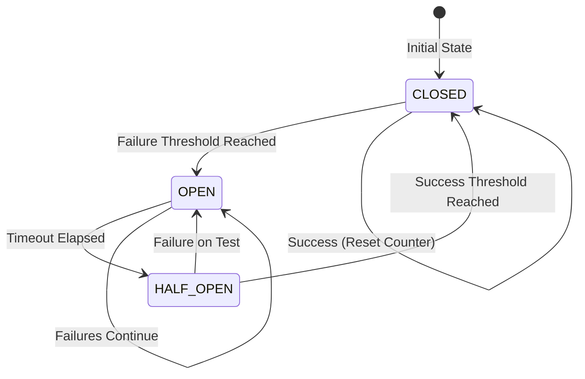
```mermaid
stateDiagram-v2
    [*] --> CLOSED: Initial State
    CLOSED --> OPEN: Failure Threshold Reached
    OPEN --> HALF_OPEN: Timeout Elapsed
    HALF_OPEN --> CLOSED: Success Threshold Reached
    HALF_OPEN --> OPEN: Failure on Test
    CLOSED --> CLOSED: Success (Reset Counter)
    OPEN --> OPEN: Failures Continue
```

## Real-Time Streaming Flow

### SSE Streaming Flow

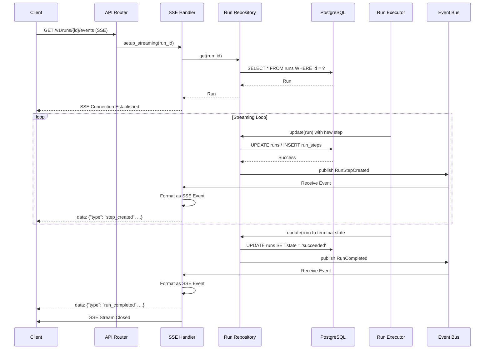
```mermaid
sequenceDiagram
    participant Client
    participant API as API Router
    participant SSE as SSE Handler
    participant Repo as Run Repository
    participant DB as PostgreSQL
    participant Worker as Run Executor
    participant Events as Event Bus
    
    Client->>API: GET /v1/runs/{id}/events (SSE)
    API->>SSE: setup_streaming(run_id)
    SSE->>Repo: get(run_id)
    Repo->>DB: SELECT * FROM runs WHERE id = ?
    DB-->>Repo: Run
    Repo-->>SSE: Run
    SSE-->>Client: SSE Connection Established
    
    loop Streaming Loop
        Worker->>Repo: update(run) with new step
        Repo->>DB: UPDATE runs / INSERT run_steps
        DB-->>Repo: Success
        Repo->>Events: publish RunStepCreated
        Events->>SSE: Receive Event
        SSE->>SSE: Format as SSE Event
        SSE-->>Client: data: {"type": "step_created", ...}
    end
    
    Worker->>Repo: update(run) to terminal state
    Repo->>DB: UPDATE runs SET state = 'succeeded'
    Repo->>Events: publish RunCompleted
    Events->>SSE: Receive Event
    SSE->>SSE: Format as SSE Event
    SSE-->>Client: data: {"type": "run_completed", ...}
    SSE->>Client: SSE Stream Closed
```

## Cancellation Flow

### Cancellation Handling Flow

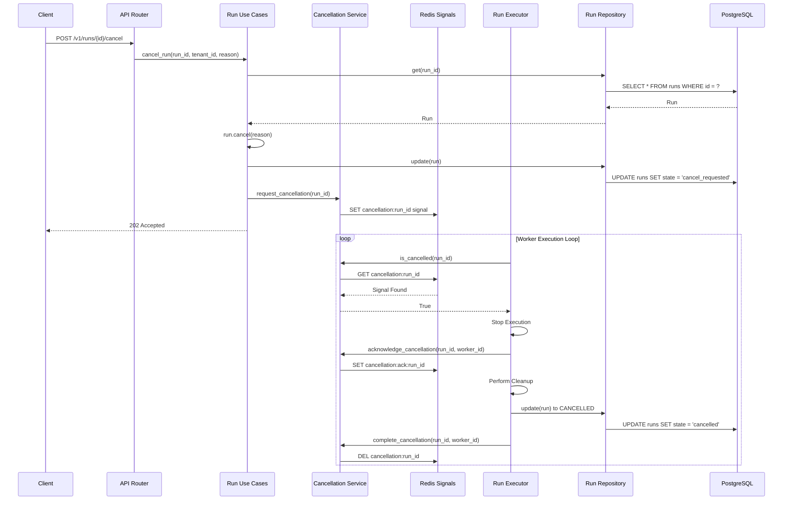
```mermaid
sequenceDiagram
    participant Client
    participant API as API Router
    participant UC as Run Use Cases
    participant Cancellation as Cancellation Service
    participant Redis as Redis Signals
    participant Worker as Run Executor
    participant Repo as Run Repository
    participant DB as PostgreSQL
    
    Client->>API: POST /v1/runs/{id}/cancel
    API->>UC: cancel_run(run_id, tenant_id, reason)
    UC->>Repo: get(run_id)
    Repo->>DB: SELECT * FROM runs WHERE id = ?
    DB-->>Repo: Run
    Repo-->>UC: Run
    UC->>UC: run.cancel(reason)
    UC->>Repo: update(run)
    Repo->>DB: UPDATE runs SET state = 'cancel_requested'
    UC->>Cancellation: request_cancellation(run_id)
    Cancellation->>Redis: SET cancellation:run_id signal
    UC-->>Client: 202 Accepted
    
    loop Worker Execution Loop
        Worker->>Cancellation: is_cancelled(run_id)
        Cancellation->>Redis: GET cancellation:run_id
        Redis-->>Cancellation: Signal Found
        Cancellation-->>Worker: True
        Worker->>Worker: Stop Execution
        Worker->>Cancellation: acknowledge_cancellation(run_id, worker_id)
        Cancellation->>Redis: SET cancellation:ack:run_id
        Worker->>Worker: Perform Cleanup
        Worker->>Repo: update(run) to CANCELLED
        Repo->>DB: UPDATE runs SET state = 'cancelled'
        Worker->>Cancellation: complete_cancellation(run_id, worker_id)
        Cancellation->>Redis: DEL cancellation:run_id
    end
```

## Audit Event Flow

### Audit Event Generation and Delivery

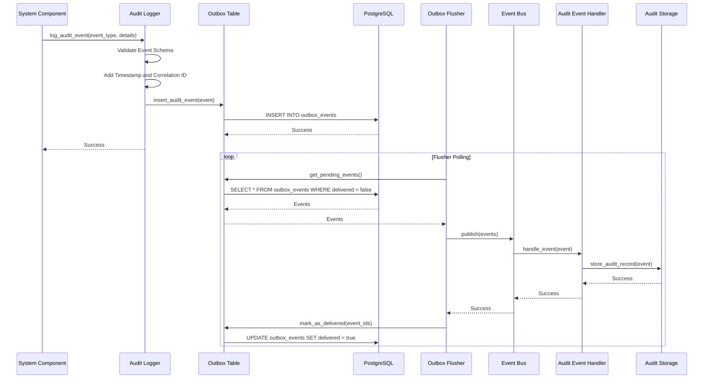
```mermaid
sequenceDiagram
    participant Component as System Component
    participant Audit as Audit Logger
    participant Outbox as Outbox Table
    participant DB as PostgreSQL
    participant Flusher as Outbox Flusher
    participant EventBus as Event Bus
    participant Handler as Audit Event Handler
    participant Storage as Audit Storage
    
    Component->>Audit: log_audit_event(event_type, details)
    Audit->>Audit: Validate Event Schema
    Audit->>Audit: Add Timestamp and Correlation ID
    Audit->>Outbox: insert_audit_event(event)
    Outbox->>DB: INSERT INTO outbox_events
    DB-->>Outbox: Success
    Audit-->>Component: Success
    
    loop Flusher Polling
        Flusher->>Outbox: get_pending_events()
        Outbox->>DB: SELECT * FROM outbox_events WHERE delivered = false
        DB-->>Outbox: Events
        Outbox-->>Flusher: Events
        Flusher->>EventBus: publish(events)
        EventBus->>Handler: handle_event(event)
        Handler->>Storage: store_audit_record(event)
        Storage-->>Handler: Success
        Handler-->>EventBus: Success
        EventBus-->>Flusher: Success
        Flusher->>Outbox: mark_as_delivered(event_ids)
        Outbox->>DB: UPDATE outbox_events SET delivered = true
    end
```

## Error Handling Flow

### Error Propagation and Handling

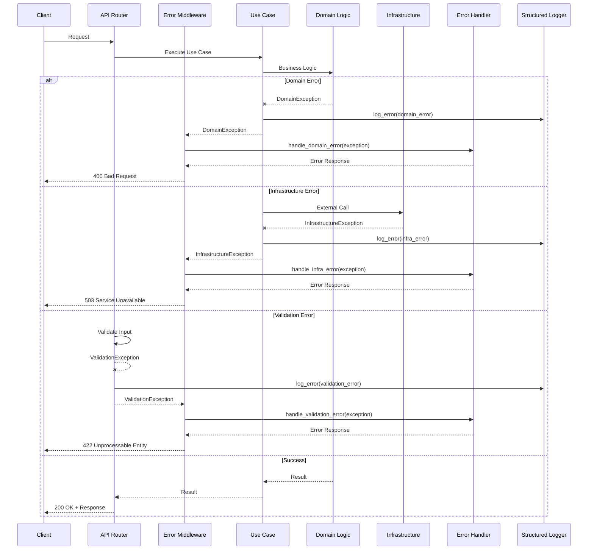
```mermaid
sequenceDiagram
    participant Client
    participant API as API Router
    participant Middleware as Error Middleware
    participant UC as Use Case
    participant Domain as Domain Logic
    participant Infra as Infrastructure
    participant Handler as Error Handler
    participant Logger as Structured Logger
    
    Client->>API: Request
    API->>UC: Execute Use Case
    UC->>Domain: Business Logic
    
    alt Domain Error
        Domain--xUC: DomainException
        UC->>Logger: log_error(domain_error)
        UC-->>Middleware: DomainException
        Middleware->>Handler: handle_domain_error(exception)
        Handler-->>Middleware: Error Response
        Middleware-->>Client: 400 Bad Request
    else Infrastructure Error
        UC->>Infra: External Call
        Infra--xUC: InfrastructureException
        UC->>Logger: log_error(infra_error)
        UC-->>Middleware: InfrastructureException
        Middleware->>Handler: handle_infra_error(exception)
        Handler-->>Middleware: Error Response
        Middleware-->>Client: 503 Service Unavailable
    else Validation Error
        API->>API: Validate Input
        API--xAPI: ValidationException
        API->>Logger: log_error(validation_error)
        API-->>Middleware: ValidationException
        Middleware->>Handler: handle_validation_error(exception)
        Handler-->>Middleware: Error Response
        Middleware-->>Client: 422 Unprocessable Entity
    else Success
        Domain-->>UC: Result
        UC-->>API: Result
        API-->>Client: 200 OK + Response
    end
```

## Cost Tracking Flow

### Cost Calculation and Budget Enforcement

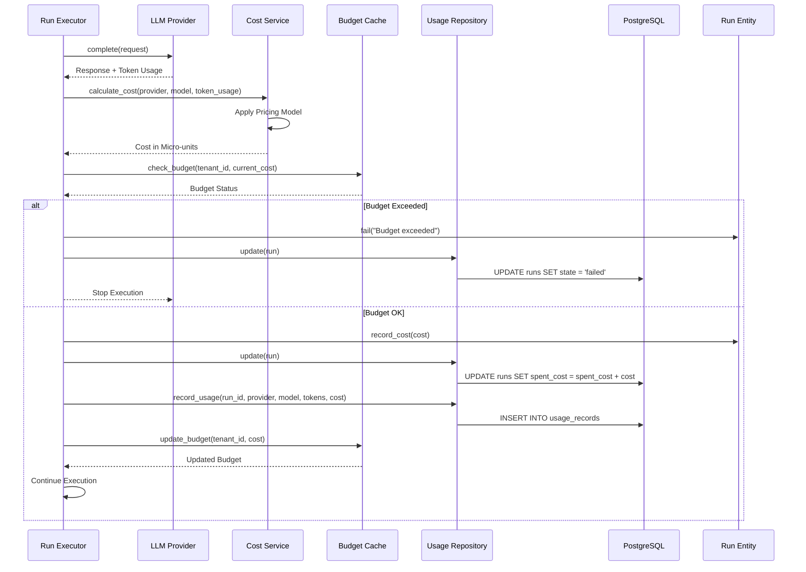
```mermaid
sequenceDiagram
    participant Worker as Run Executor
    participant Provider as LLM Provider
    participant CostService as Cost Service
    participant BudgetCache as Budget Cache
    participant Repo as Usage Repository
    participant DB as PostgreSQL
    participant Run as Run Entity
    
    Worker->>Provider: complete(request)
    Provider-->>Worker: Response + Token Usage
    Worker->>CostService: calculate_cost(provider, model, token_usage)
    CostService->>CostService: Apply Pricing Model
    CostService-->>Worker: Cost in Micro-units
    Worker->>BudgetCache: check_budget(tenant_id, current_cost)
    BudgetCache-->>Worker: Budget Status
    
    alt Budget Exceeded
        Worker->>Run: fail("Budget exceeded")
        Worker->>Repo: update(run)
        Repo->>DB: UPDATE runs SET state = 'failed'
        Worker-->>Provider: Stop Execution
    else Budget OK
        Worker->>Run: record_cost(cost)
        Worker->>Repo: update(run)
        Repo->>DB: UPDATE runs SET spent_cost = spent_cost + cost
        Worker->>Repo: record_usage(run_id, provider, model, tokens, cost)
        Repo->>DB: INSERT INTO usage_records
        Worker->>BudgetCache: update_budget(tenant_id, cost)
        BudgetCache-->>Worker: Updated Budget
        Worker->>Worker: Continue Execution
    end
```

## Multi-Tenant Data Flow

### Tenant Isolation in Data Access

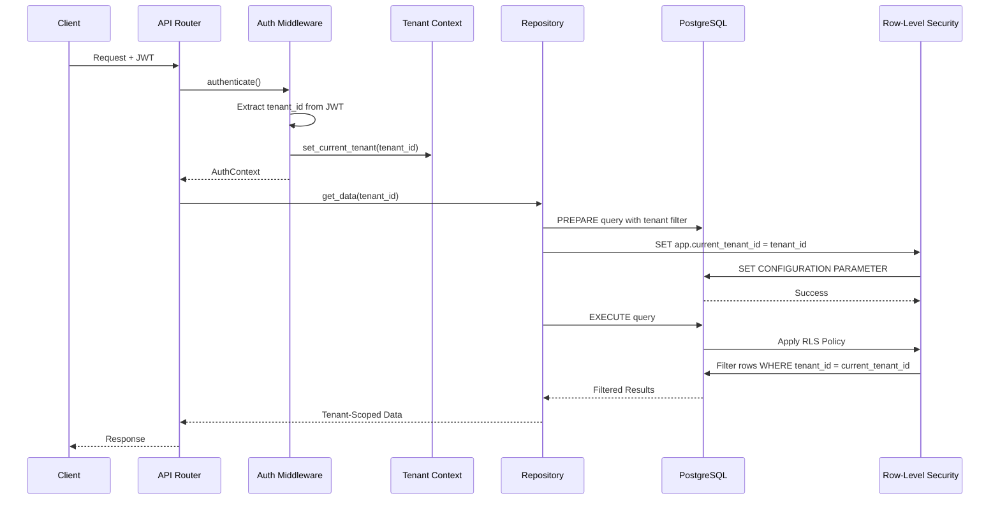
```mermaid
sequenceDiagram
    participant Client
    participant API as API Router
    participant Auth as Auth Middleware
    participant Context as Tenant Context
    participant Repo as Repository
    participant DB as PostgreSQL
    participant RLS as Row-Level Security
    
    Client->>API: Request + JWT
    API->>Auth: authenticate()
    Auth->>Auth: Extract tenant_id from JWT
    Auth->>Context: set_current_tenant(tenant_id)
    Auth-->>API: AuthContext
    API->>Repo: get_data(tenant_id)
    Repo->>DB: PREPARE query with tenant filter
    Repo->>RLS: SET app.current_tenant_id = tenant_id
    RLS->>DB: SET CONFIGURATION PARAMETER
    DB-->>RLS: Success
    Repo->>DB: EXECUTE query
    DB->>RLS: Apply RLS Policy
    RLS->>DB: Filter rows WHERE tenant_id = current_tenant_id
    DB-->>Repo: Filtered Results
    Repo-->>API: Tenant-Scoped Data
    API-->>Client: Response
```

## Event-Driven Flow

### Domain Event Publishing and Handling

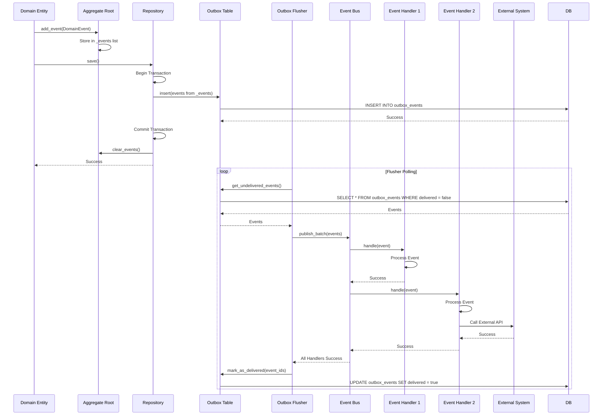
```mermaid
sequenceDiagram
    participant Entity as Domain Entity
    participant Aggregate as Aggregate Root
    participant Repository as Repository
    participant Outbox as Outbox Table
    participant Flusher as Outbox Flusher
    participant EventBus as Event Bus
    participant Handler1 as Event Handler 1
    participant Handler2 as Event Handler 2
    participant External as External System
    
    Entity->>Aggregate: add_event(DomainEvent)
    Aggregate->>Aggregate: Store in _events list
    Entity->>Repository: save()
    Repository->>Repository: Begin Transaction
    Repository->>Outbox: insert(events from _events)
    Outbox->>DB: INSERT INTO outbox_events
    DB-->>Outbox: Success
    Repository->>Repository: Commit Transaction
    Repository->>Aggregate: clear_events()
    Repository-->>Entity: Success
    
    loop Flusher Polling
        Flusher->>Outbox: get_undelivered_events()
        Outbox->>DB: SELECT * FROM outbox_events WHERE delivered = false
        DB-->>Outbox: Events
        Outbox-->>Flusher: Events
        Flusher->>EventBus: publish_batch(events)
        EventBus->>Handler1: handle(event)
        Handler1->>Handler1: Process Event
        Handler1-->>EventBus: Success
        EventBus->>Handler2: handle(event)
        Handler2->>Handler2: Process Event
        Handler2->>External: Call External API
        External-->>Handler2: Success
        Handler2-->>EventBus: Success
        EventBus-->>Flusher: All Handlers Success
        Flusher->>Outbox: mark_as_delivered(event_ids)
        Outbox->>DB: UPDATE outbox_events SET delivered = true
    end
```

This data flow documentation provides comprehensive coverage of all major operations in the AIAgentX system, illustrating how data moves through the architecture layers and components with detailed sequence diagrams and state machines.