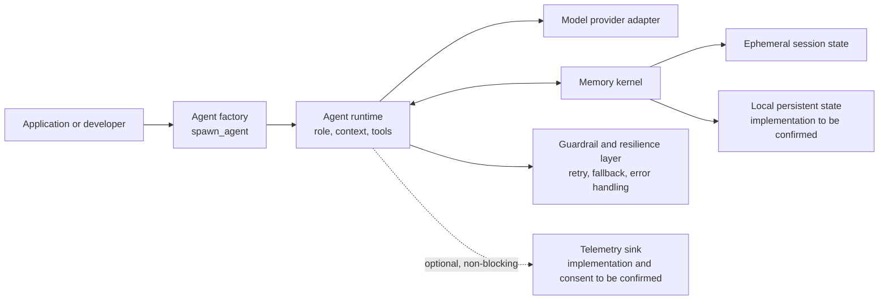

# AIAgentX High-Level Technical Documentation

**Status:** Conceptual architecture draft - source validation pending  
**Reference:** `AIAgentX_High_Level_Documentation.pdf` supplied with this task  
**Repository state at authoring:** no application files or commits were present in the checkout.

## 1. Purpose and scope

AIAgentX is described in the supplied reference as a configuration-light, multi-agent runtime. Its proposed design uses convention over configuration so an application can create an agent, assign a role and tools, choose a memory mode, and execute work through a small public API.

This document communicates the intended architecture at a product and system boundary level. It is deliberately not an implementation specification. Names, interface shapes, storage choices, retry behavior, provider support, and telemetry behavior must be confirmed against the implementation when source becomes available.

## 2. Design intent

The reference design aims to provide:

- A simple agent-creation entry point that turns a semantic role into a configured runtime context.
- Tool binding and runtime context assembly with minimal application boilerplate.
- Session memory that can be either short-lived in-process state or local persistent state.
- Resilience behavior for transient provider and network failures.
- Optional operational telemetry that does not block the primary execution path.

The design does **not** establish a stable production API, a particular storage engine, security model, service-level objective, or data-retention policy. Those remain validation and design decisions.

## 3. Conceptual architecture



| Component | Responsibility | Status |
| --- | --- | --- |
| Agent factory | Creates a runtime from role, tools, memory, and model inputs. | Reference-defined concept |
| Agent runtime | Holds instruction context, invokes tools, and coordinates a model interaction. | Reference-defined concept |
| Memory kernel | Provides ephemeral and local memory modes. | Storage technology and lifecycle unverified |
| Resilience layer | Handles transient failures and may select a fallback provider. | Exact policy and error taxonomy unverified |
| Telemetry hook | Emits usage or execution metadata without blocking the main request. | Optional integration and privacy model unverified |

## 4. Runtime flow

1. An application calls the factory with a role and optional tool, memory, and model preferences.
2. The factory validates inputs, builds the agent context, and binds permitted tools.
3. The agent executes an interaction through a model-provider adapter.
4. Relevant session context is read from and written to the selected memory mode.
5. Transient failures are evaluated by the resilience layer; a retry or provider fallback may occur when policy allows it.
6. If configured, anonymized or approved operational events are emitted asynchronously to telemetry.
7. The runtime returns a result or a structured failure to the calling application.

The sequence is architectural intent, not evidence of a current implementation.

## 5. Proposed public interface

The supplied reference presents `spawn_agent` as the primary entry point. The following signature is illustrative only:

```python
from ai_agent_x import spawn_agent

agent = spawn_agent(
    role="researcher",
    tools=["web_search"],
    memory="local",
    model="gpt-4o",
)

response = agent.ask("Analyze market gaps in AI infrastructure.")
```

| Parameter | Intended meaning | Default shown in reference | Validation needed |
| --- | --- | --- | --- |
| `role` | Persona, operating boundary, or instruction set for the agent. | Required | Accepted schema and safety rules |
| `tools` | Approved runtime utilities available to the agent. | `[]` | Registration, authorization, and isolation model |
| `memory` | Session-state selection. | `"ephemeral"` | Values, durability, encryption, retention |
| `model` | Preferred underlying model or route. | `"gpt-4o"` | Provider mapping, versioning, fallback behavior |

## 6. Operational and security considerations

Before production use, the implementation should document and test:

- Authentication, authorization, and least-privilege tool execution.
- Secret handling for model providers, tool integrations, and telemetry.
- Input and output safety controls, including tool-call approvals where required.
- Memory data classification, encryption, retention, deletion, and tenant isolation.
- Retry limits, timeout budgets, idempotency, circuit-breaking, and fallback criteria.
- Observability event schema, user consent, redaction, and opt-out behavior.
- API versioning, error contracts, logging, and incident-response procedures.

## 7. Validation checklist for the implementation

When application source is available, update this document by verifying the following items:

1. Identify the package entry points, supported language runtimes, and released version.
2. Trace agent creation through tool binding, model invocation, error handling, and result return.
3. Record actual memory providers, schema, persistence boundaries, and cleanup behavior.
4. Document provider adapters, retry/backoff policy, rate-limit handling, and fallback semantics.
5. Verify telemetry payloads, transport, privacy controls, and whether reporting is truly non-blocking.
6. Add deployment topology, configuration reference, test strategy, and developer onboarding steps.

## 8. Ownership and document maintenance

Maintain this document alongside public-interface or runtime-architecture changes. Each statement should be tagged as either implementation-verified, proposal, or deprecated design intent. Once source is present, replace illustrative snippets and unverified wording with links to the authoritative modules and tests.
