# AIAgentX Memory System Documentation

## Overview

AIAgentX implements a sophisticated tiered memory system that provides AI agents with different levels of persistence and recall capabilities. The memory system supports three distinct scopes: ephemeral (per-run), session (conversational), and durable (long-term semantic memory), each optimized for specific use cases.

## Memory Architecture Diagram

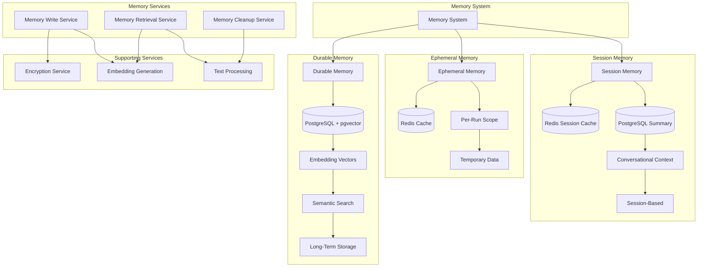

## Memory Scopes

### Memory Scope Comparison

| Scope | Duration | Storage | Use Case | Performance | Cost |
|-------|----------|---------|----------|-------------|------|
| **Ephemeral** | Single run | Redis | Temporary variables, intermediate results | Highest | Lowest |
| **Session** | Multiple runs | Redis + PostgreSQL | Conversation context, short-term memory | High | Low |
| **Durable** | Long-term | PostgreSQL + pgvector | Knowledge base, long-term learning | Medium | Medium |

### Memory Scope State Machine

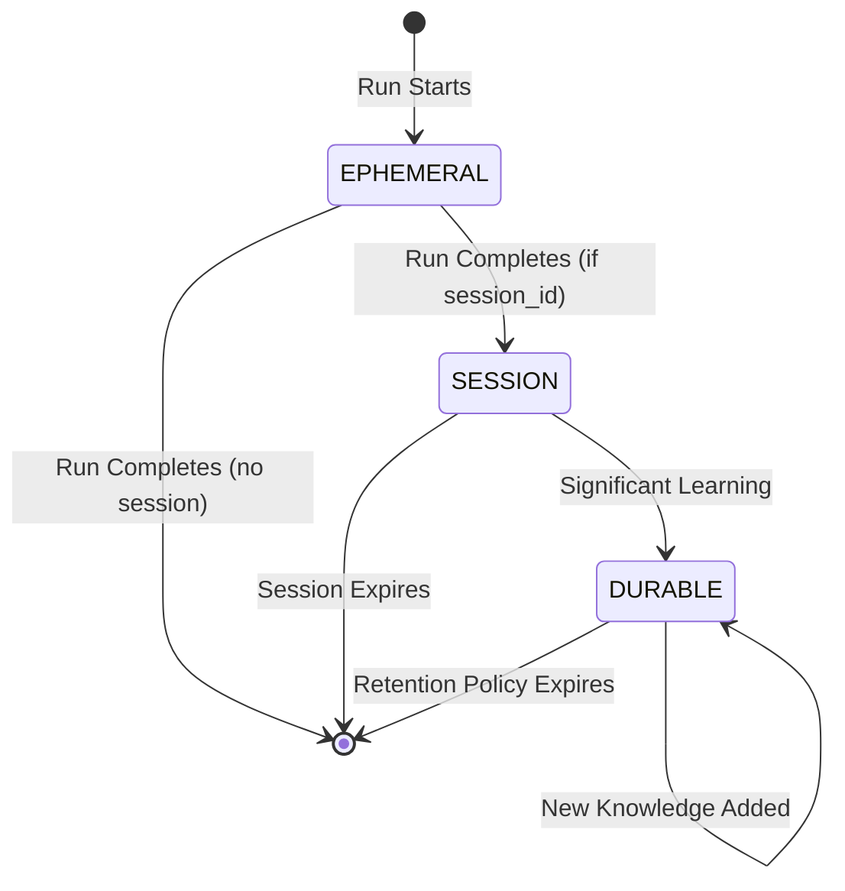

## Ephemeral Memory

### Ephemeral Memory Architecture

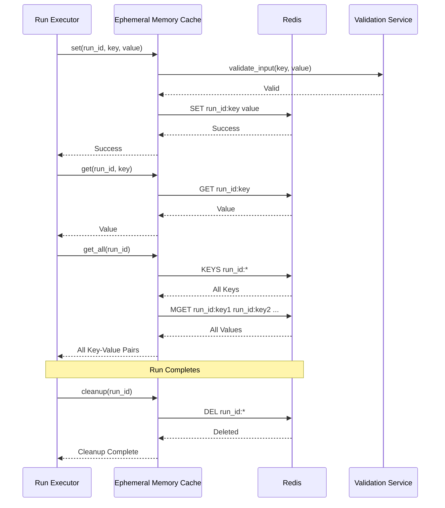

### Ephemeral Memory Characteristics

- **Storage:** Redis in-memory data store
- **Scope:** Individual run execution
- **TTL:** Configured to match run timeout
- **Data Types:** Strings, numbers, JSON objects
- **Capacity:** Limited by Redis memory
- **Performance:** Sub-millisecond access times
- **Persistence:** Optional Redis persistence
- **Cleanup:** Automatic on run completion

### Ephemeral Memory Usage Examples

```python
# During run execution
await ephemeral_cache.set(run_id, "intermediate_result", calculation_result)
await ephemeral_cache.set(run_id, "step_count", current_step)
await ephemeral_cache.set(run_id, "user_preferences", user_settings)

# Retrieval during execution
result = await ephemeral_cache.get(run_id, "intermediate_result")
all_data = await ephemeral_cache.get_all(run_id)
```

## Session Memory

### Session Memory Architecture

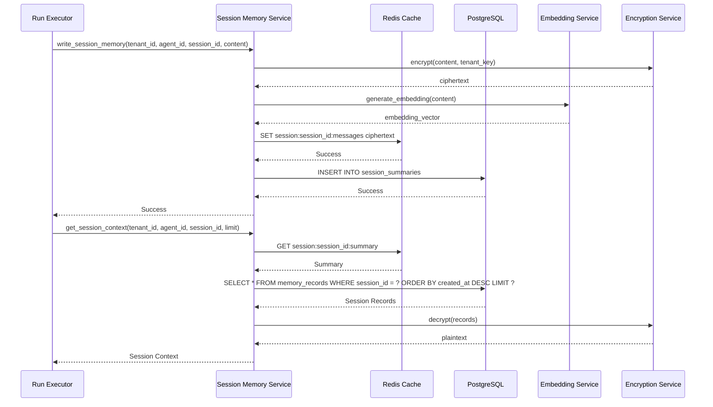

### Session Memory Components

#### Redis Session Cache
- **Key Pattern:** `session:{session_id}:{type}`
- **Data Types:** 
  - Messages: List of conversation messages
  - Summary: Compressed session summary
  - Metadata: Session metadata
- **TTL:** Configurable session timeout
- **Eviction:** LRU eviction when memory pressure

#### PostgreSQL Session Storage
- **Table:** `session_summaries`
- **Fields:** session_id, tenant_id, agent_id, summary_ciphertext, metadata
- **Indexing:** session_id, tenant_id, created_at
- **Retention:** Configurable retention policy

### Session Memory Lifecycle

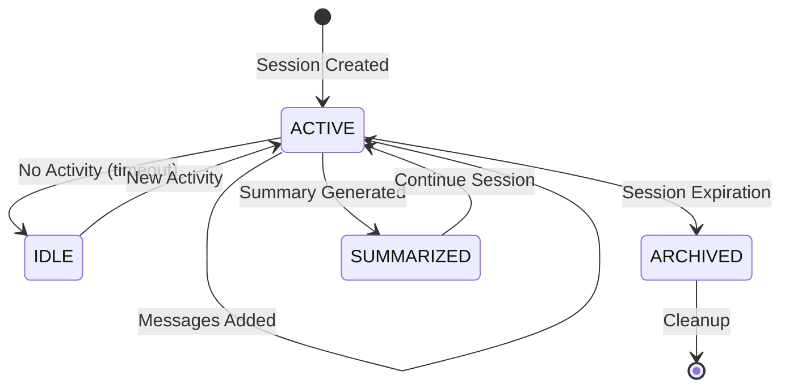

### Session Memory Features

- **Conversation Context:** Maintains conversation history
- **Summarization:** Automatic summarization of long sessions
- **Context Window:** Configurable context window size
- **Memory Consolidation:** Consolidates similar information
- **Session Management:** Session creation, retrieval, cleanup
- **Cross-Run Persistence:** Maintains context across multiple runs

## Durable Memory

### Durable Memory Architecture

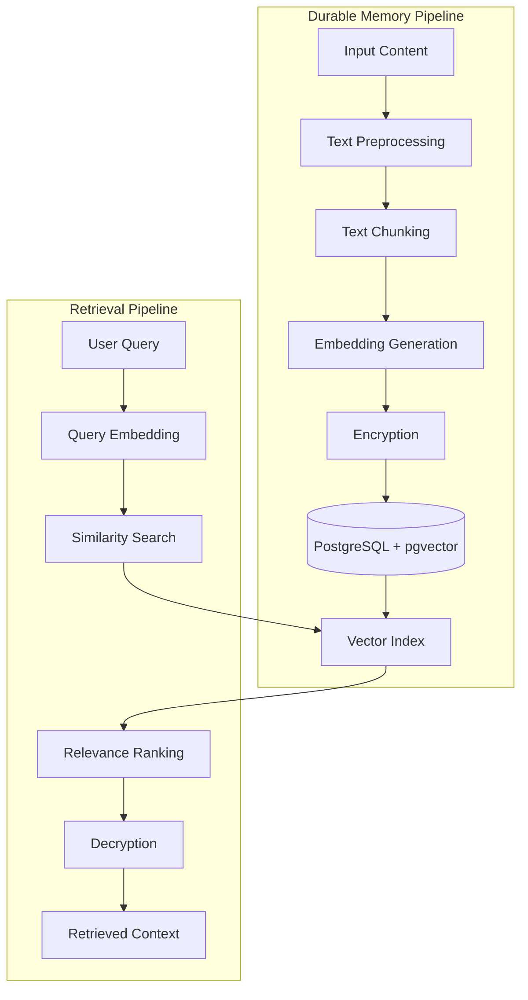

### Durable Memory Schema

```sql
CREATE TABLE memory_records (
    id UUID PRIMARY KEY DEFAULT gen_random_uuid(),
    tenant_id UUID NOT NULL REFERENCES tenants(id) ON DELETE CASCADE,
    agent_id UUID NOT NULL REFERENCES agents(id) ON DELETE CASCADE,
    scope VARCHAR(20) NOT NULL,
    namespace VARCHAR(100) NOT NULL,
    content_ciphertext TEXT NOT NULL,
    embedding vector(1536),
    metadata JSONB DEFAULT '{}',
    allowed_use_label VARCHAR(20) DEFAULT 'public',
    session_id VARCHAR(100),
    expires_at TIMESTAMP WITH TIME ZONE,
    created_at TIMESTAMP WITH TIME ZONE DEFAULT NOW(),
    updated_at TIMESTAMP WITH TIME ZONE DEFAULT NOW()
);

-- Vector index for similarity search
CREATE INDEX memory_records_embedding_idx ON memory_records 
USING ivfflat (embedding vector_cosine_ops) 
WITH (lists = 100);

-- Tenant and scope indexes
CREATE INDEX memory_records_tenant_scope_idx ON memory_records (tenant_id, scope);
CREATE INDEX memory_records_agent_idx ON memory_records (agent_id);
CREATE INDEX memory_records_session_idx ON memory_records (session_id) WHERE session_id IS NOT NULL;
CREATE INDEX memory_records_expires_at_idx ON memory_records (expires_at) WHERE expires_at IS NOT NULL;
```

### Embedding Generation

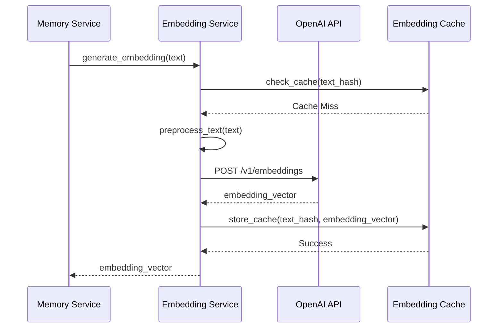

### Semantic Search Implementation

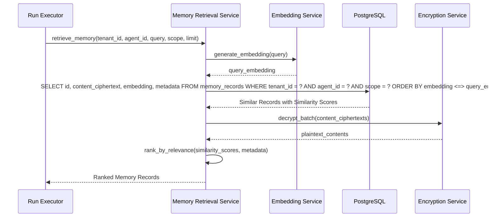

### Text Processing Pipeline

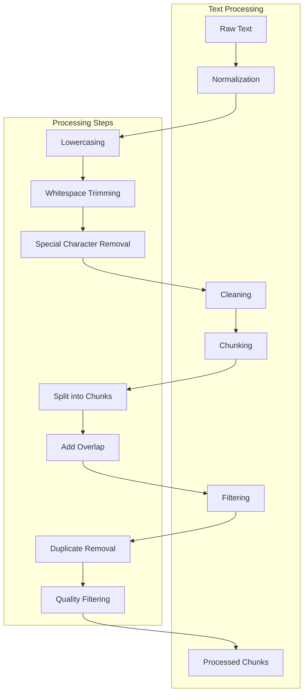

### Memory Retrieval Strategies

| Strategy | Description | Use Case | Performance |
|----------|-------------|----------|-------------|
| **Semantic Search** | Vector similarity search | Conceptual queries | Medium |
| **Keyword Search** | Full-text search | Specific terms | Fast |
| **Hybrid Search** | Combined semantic + keyword | Balanced approach | Medium |
| **Temporal Search** | Time-based retrieval | Recent information | Fast |
| **Namespace Search** | Namespace-specific | Organized retrieval | Fast |

## Memory Security

### Data Classification

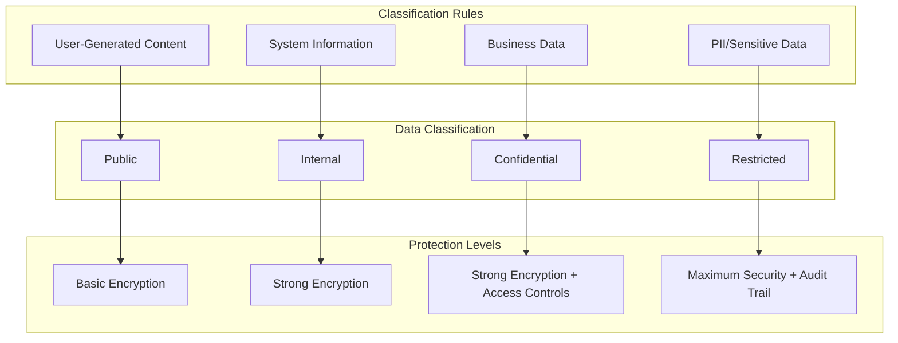

### Encryption Strategy

- **Algorithm:** AES-256-GCM for content encryption
- **Key Management:** Tenant-specific encryption keys
- **Key Rotation:** Automatic key rotation (90 days)
- **Scope:** All sensitive memory content encrypted
- **Performance:** Optimized encryption operations

### Access Control

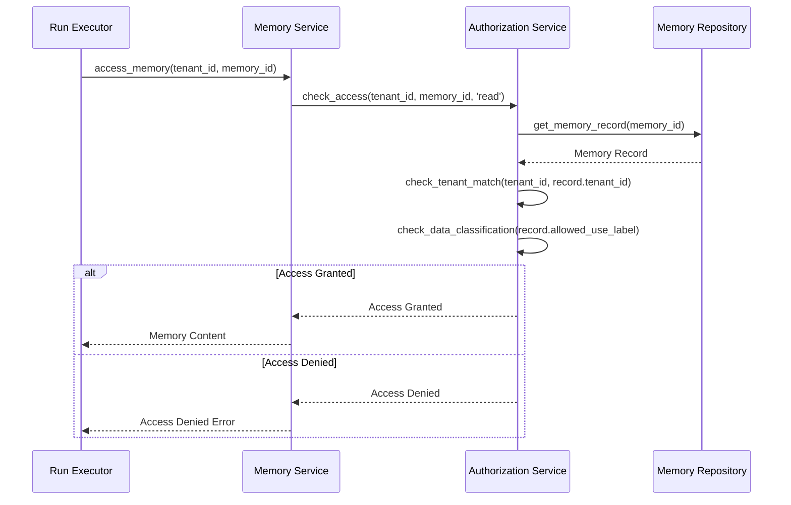

## Memory Cleanup and Retention

### Retention Policy

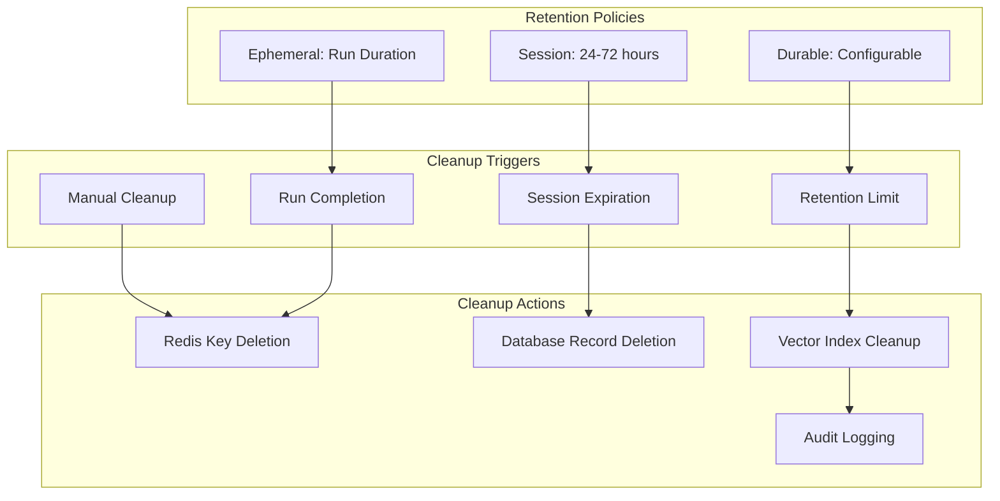

### Retention Configuration

| Scope | Default Retention | Maximum Retention | Cleanup Strategy |
|-------|------------------|-------------------|------------------|
| Ephemeral | Run duration | 24 hours | Immediate on completion |
| Session | 24 hours | 72 hours | Scheduled cleanup |
| Durable | 90 days | 365 days | Scheduled cleanup |

### Memory Quotas

```python
# Memory quota configuration
class MemoryQuota:
    max_records_per_tenant: int = 10000
    max_storage_mb_per_tenant: int = 1000
    max_embeddings_per_tenant: int = 100000
    max_session_duration_hours: int = 72
```

## Memory Performance Optimization

### Caching Strategy

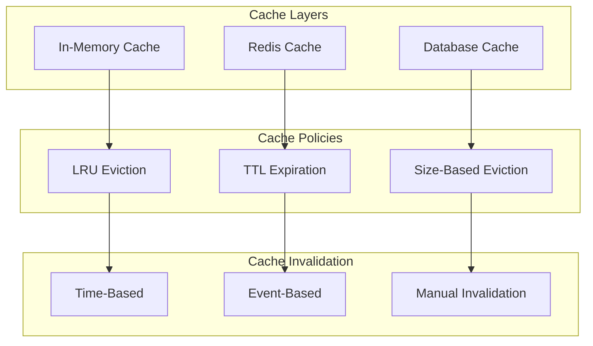

### Performance Characteristics

| Operation | Ephemeral | Session | Durable |
|-----------|-----------|---------|---------|
| Write | <1ms | 5-10ms | 50-100ms |
| Read | <1ms | 2-5ms | 20-50ms |
| Search | N/A | 10-20ms | 50-200ms |
| Delete | <1ms | 5-10ms | 20-50ms |

## Memory Usage Patterns

### Common Usage Patterns

#### Pattern 1: Conversation Memory
```python
# Store conversation in session memory
await memory_write_service.write_memory(
    tenant_id=tenant_id,
    agent_id=agent_id,
    content=user_message,
    scope=MemoryScope.SESSION,
    namespace="conversation",
    metadata={"role": "user", "timestamp": now()},
    session_id=session_id
)
```

#### Pattern 2: Knowledge Storage
```python
# Store knowledge in durable memory
await memory_write_service.write_memory(
    tenant_id=tenant_id,
    agent_id=agent_id,
    content=knowledge_text,
    scope=MemoryScope.DURABLE,
    namespace="knowledge_base",
    metadata={"category": "technical", "importance": "high"}
)
```

#### Pattern 3: Temporary State
```python
# Store temporary state in ephemeral memory
await ephemeral_cache.set(run_id, "processing_state", "intermediate_result")
```

#### Pattern 4: Context Retrieval
```python
# Retrieve relevant context for query
relevant_memory = await memory_retrieval_service.retrieve_memory(
    tenant_id=tenant_id,
    agent_id=agent_id,
    query=user_query,
    scope=MemoryScope.DURABLE,
    namespace="knowledge_base",
    limit=5
)
```

## Memory Monitoring and Observability

### Memory Metrics

```mermaid
graph TB
    subgraph "Memory Metrics"
        STORAGE[Storage Metrics]
        PERFORMANCE[Performance Metrics]
        QUALITY[Quality Metrics]
        USAGE[Usage Metrics]
    end
    
    subgraph "Storage Metrics"
        TOTAL_STORAGE[Total Storage Used]
        STORAGE_PER_TENANT[Storage per Tenant]
        STORAGE_PER_SCOPE[Storage per Scope]
    end
    
    subgraph "Performance Metrics"
        WRITE_LATENCY[Write Latency]
        READ_LATENCY[Read Latency]
        SEARCH_LATENCY[Search Latency]
        CACHE_HIT_RATIO[Cache Hit Ratio]
    end
    
    subgraph "Quality Metrics"
        EMBEDDING_QUALITY[Embedding Quality]
        RETRIEVAL_PRECISION[Retrieval Precision]
        RETRIEVAL_RECALL[Retrieval Recall]
    end
    
    subgraph "Usage Metrics"
        MEMORY_OPERATIONS[Memory Operations]
        UNIQUE_USERS[Unique Users]
        ACTIVE_SESSIONS[Active Sessions]
    end
    
    STORAGE --> TOTAL_STORAGE
    STORAGE --> STORAGE_PER_TENANT
    STORAGE --> STORAGE_PER_SCOPE
    PERFORMANCE --> WRITE_LATENCY
    PERFORMANCE --> READ_LATENCY
    PERFORMANCE --> SEARCH_LATENCY
    PERFORMANCE --> CACHE_HIT_RATIO
    QUALITY --> EMBEDDING_QUALITY
    QUALITY --> RETRIEVAL_PRECISION
    QUALITY --> RETRIEVAL_RECALL
    USAGE --> MEMORY_OPERATIONS
    USAGE --> UNIQUE_USERS
    USAGE --> ACTIVE_SESSIONS
```

### Monitoring Dashboards

- **Storage Overview:** Total storage, tenant breakdown, scope distribution
- **Performance Dashboard:** Latency metrics, cache performance, query patterns
- **Quality Metrics:** Embedding quality, retrieval effectiveness
- **Usage Analytics:** Active sessions, popular namespaces, access patterns

## Memory Configuration

### Environment Configuration

```env
# Memory Configuration
MEMORY_ENABLED=true
EPHEMERAL_MEMORY_ENABLED=true
SESSION_MEMORY_ENABLED=true
DURABLE_MEMORY_ENABLED=true

# Redis Configuration
REDIS_URL=redis://localhost:6379/0
REDIS_MEMORY_DB=1
REDIS_SESSION_DB=2

# Embedding Configuration
EMBEDDING_PROVIDER=openai
EMBEDDING_MODEL=text-embedding-3-small
EMBEDDING_DIMENSIONS=1536
EMBEDDING_CACHE_ENABLED=true

# Durable Memory Configuration
DURABLE_MEMORY_RETENTION_DAYS=90
DURABLE_MEMORY_MAX_RECORDS_PER_TENANT=10000
DURABLE_MEMORY_MAX_STORAGE_MB_PER_TENANT=1000

# Vector Search Configuration
VECTOR_INDEX_TYPE=ivfflat
VECTOR_INDEX_LISTS=100
SIMILARITY_THRESHOLD=0.7
MAX_RETRIEVAL_RESULTS=10
```

This memory system documentation provides comprehensive coverage of the tiered memory architecture, including detailed implementation details, security considerations, performance characteristics, and usage patterns for all memory scopes in AIAgentX.