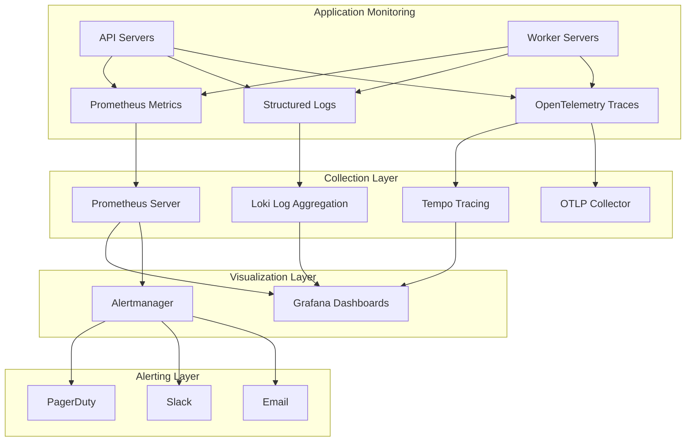
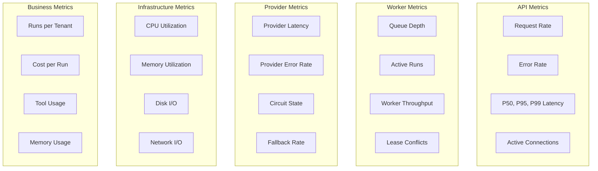
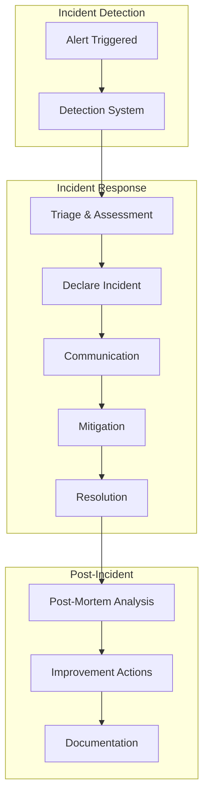
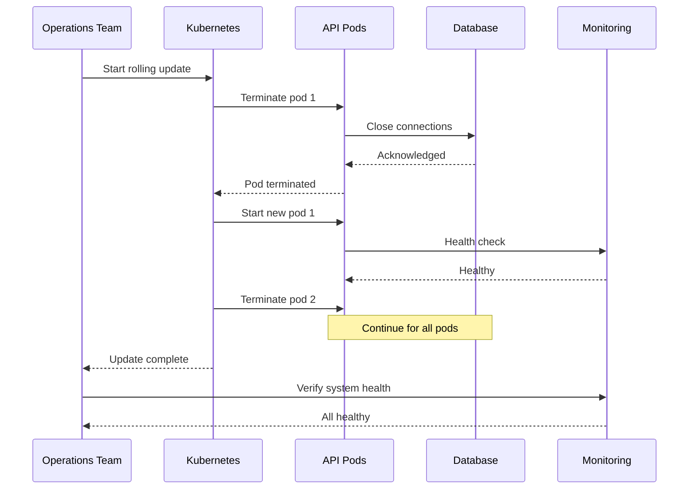
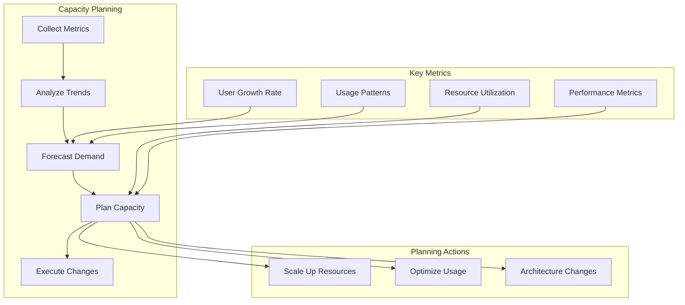

# AIAgentX Operational Documentation

## Overview

This document provides comprehensive operational guidance for running and maintaining AIAgentX in production. It includes monitoring procedures, troubleshooting runbooks, incident response processes, and maintenance procedures.

## Monitoring Architecture

### Monitoring Stack Overview



## Key Metrics

### Application Metrics



### Critical Metrics Thresholds

| Metric | Warning | Critical | Description |
|--------|---------|----------|-------------|
| **API Error Rate** | >1% | >5% | Percentage of failed API requests |
| **API Latency P95** | >1s | >5s | 95th percentile latency |
| **Queue Depth** | >100 | >500 | Number of queued runs |
| **Provider Error Rate** | >5% | >20% | Provider API error rate |
| **Circuit Open** | Any | Any | Circuit breaker state |
| **Database Pool** | >80% | >95% | Connection pool utilization |
| **Memory Usage** | >80% | >95% | Memory utilization |
| **Disk Usage** | >80% | >95% | Disk utilization |

## Monitoring Dashboards

### System Overview Dashboard

```mermaid
graph TB
    subgraph "System Overview Dashboard"
        HEALTH[System Health]
        TRAFFIC[Traffic Overview]
        PERFORMANCE[Performance Metrics]
        RESOURCES[Resource Utilization]
    end
    
    subgraph "Health Panels"
        API_HEALTH[API Health Status]
        WORKER_HEALTH[Worker Health Status]
        DB_HEALTH[Database Health Status]
        REDIS_HEALTH[Redis Health Status]
    end
    
    subgraph "Traffic Panels"
        REQUEST_RATE[Request Rate per Minute]
        ERROR_RATE[Error Rate per Minute]
        ACTIVE_RUNS[Active Runs Count]
        QUEUE_DEPTH[Queue Depth]
    end
    
    subgraph "Performance Panels"
        LATENCY_HISTOGRAM[Latency Histogram]
        PROVIDER_LATENCY[Provider Latency]
        DATABASE_LATENCY[Database Latency]
        CACHE_HIT_RATIO[Cache Hit Ratio]
    end
    
    subgraph "Resource Panels"
        CPU_USAGE[CPU Usage by Pod]
        MEMORY_USAGE[Memory Usage by Pod]
        NETWORK_I/O[Network I/O]
        DISK_I/O[Disk I/O]
    end
    
    HEALTH --> API_HEALTH
    HEALTH --> WORKER_HEALTH
    HEALTH --> DB_HEALTH
    HEALTH --> REDIS_HEALTH
    
    TRAFFIC --> REQUEST_RATE
    TRAFFIC --> ERROR_RATE
    TRAFFIC --> ACTIVE_RUNS
    TRAFFIC --> QUEUE_DEPTH
    
    PERFORMANCE --> LATENCY_HISTOGRAM
    PERFORMANCE --> PROVIDER_LATENCY
    PERFORMANCE --> DATABASE_LATENCY
    PERFORMANCE --> CACHE_HIT_RATIO
    
    RESOURCES --> CPU_USAGE
    RESOURCES --> MEMORY_USAGE
    RESOURCES --> NETWORK_I/O
    RESOURCES --> DISK_I/O
```



## Alerting Rules

### Prometheus Alerting Configuration

```yaml
groups:
- name: aiagentx_alerts
  rules:
  # API Health Alerts
  - alert: HighErrorRate
    expr: rate(api_requests_total{status=~"5.."}[5m]) > 0.05
    for: 5m
    labels:
      severity: critical
      service: api
    annotations:
      summary: "High error rate detected"
      description: "Error rate is {{ $value }} for endpoint {{ $labels.endpoint }}"
  
  - alert: HighLatency
    expr: histogram_quantile(0.95, api_request_duration_seconds) > 5
    for: 5m
    labels:
      severity: warning
      service: api
    annotations:
      summary: "High latency detected"
      description: "P95 latency is {{ $value }}s"
  
  # Worker Alerts
  - alert: QueueAgeHigh
    expr: worker_queue_age_seconds{state="queued"} > 60
    for: 2m
    labels:
      severity: warning
      service: worker
    annotations:
      summary: "Queue age is high"
      description: "Queue age is {{ $value }} seconds"
  
  - alert: WorkerDown
    expr: up{job="aiagentx-worker"} == 0
    for: 1m
    labels:
      severity: critical
      service: worker
    annotations:
      summary: "Worker is down"
      description: "Worker {{ $labels.instance }} is down"
  
  # Provider Alerts
  - alert: ProviderCircuitOpen
    expr: provider_circuit_state == 0
    for: 1m
    labels:
      severity: critical
      service: provider
    annotations:
      summary: "Provider circuit breaker is open"
      description: "Provider {{ $labels.provider }} circuit is open"
  
  - alert: ProviderHighErrorRate
    expr: rate(provider_errors_total[5m]) > 0.2
    for: 5m
    labels:
      severity: warning
      service: provider
    annotations:
      summary: "Provider high error rate"
      description: "Provider {{ $labels.provider }} error rate is {{ $value }}"
  
  # Infrastructure Alerts
  - alert: DatabaseConnectionPoolExhausted
    expr: db_pool_connections_available < 5
    for: 5m
    labels:
      severity: critical
      service: database
    annotations:
      summary: "Database connection pool exhausted"
      description: "Only {{ $value }} connections available"
  
  - alert: RedisDown
    expr: up{job="redis"} == 0
    for: 1m
    labels:
      severity: critical
      service: redis
    annotations:
      summary: "Redis is down"
      description: "Redis instance {{ $labels.instance }} is down"
  
  # Business Alerts
  - alert: HighCostPerRun
    expr: cost_usd_total / runs_total > 1.0
    for: 10m
    labels:
      severity: warning
      service: business
    annotations:
      summary: "High cost per run detected"
      description: "Cost per run is ${{ $value }}"
```

## Operational Runbooks

### Runbook: API High Error Rate

**Symptoms:**
- API error rate >5%
- Increased 5xx responses
- User complaints about failed requests

**Diagnosis Steps:**

1. **Check Error Rate Dashboard**
   ```bash
   # Check current error rate
   kubectl exec -it deployment/aiagentx-api -- curl -s http://localhost:8000/metrics | grep api_requests_total
   ```

2. **Analyze Error Types**
   ```bash
   # Check error logs
   kubectl logs -f deployment/aiagentx-api --tail=100 | grep ERROR
   ```

3. **Check Dependencies**
   ```bash
   # Check database connectivity
   kubectl exec -it deployment/aiagentx-api -- pg_isready -h postgres
   
   # Check Redis connectivity
   kubectl exec -it deployment/aiagentx-api -- redis-cli -h redis ping
   ```

4. **Check Resource Usage**
   ```bash
   # Check pod resources
   kubectl top pods -n aiagentx
   ```

**Resolution Steps:**

1. **If Database Issue:**
   - Check database logs: `kubectl logs -f deployment/postgres`
   - Restart API pods if needed: `kubectl rollout restart deployment/aiagentx-api`

2. **If Redis Issue:**
   - Check Redis logs: `kubectl logs -f deployment/redis`
   - Restart Redis if needed: `kubectl rollout restart statefulset/redis`

3. **If Resource Issue:**
   - Scale up deployment: `kubectl scale deployment/aiagentx-api --replicas=5`
   - Check HPA: `kubectl get hpa -n aiagentx`

4. **If Application Issue:**
   - Check recent deployments: `kubectl rollout history deployment/aiagentx-api`
   - Rollback if needed: `kubectl rollout undo deployment/aiagentx-api`

### Runbook: Worker Queue Age High

**Symptoms:**
- Queue age >60 seconds
- Workers not processing fast enough
- Run execution delays

**Diagnosis Steps:**

1. **Check Queue Depth**
   ```bash
   # Check queue depth
   kubectl exec -it deployment/aiagentx-worker -- redis-cli -h redis LLEN run_queue
   ```

2. **Check Worker Status**
   ```bash
   # Check worker pods
   kubectl get pods -n aiagentx -l app=aiagentx-worker
   
   # Check worker logs
   kubectl logs -f deployment/aiagentx-worker
   ```

3. **Check Worker Performance**
   ```bash
   # Check worker metrics
   kubectl exec -it deployment/aiagentx-worker -- curl -s http://localhost:8000/metrics | grep worker
   ```

**Resolution Steps:**

1. **Scale Up Workers**
   ```bash
   # Scale workers
   kubectl scale deployment/aiagentx-worker --replicas=4
   
   # Or adjust HPA
   kubectl autoscale deployment aiagentx-worker --min=2 --max=8 --cpu-percent=70
   ```

2. **Check for Long-Running Runs**
   ```bash
   # Check for stuck runs
   kubectl exec -it deployment/aiagentx-api -- psql -c "SELECT id, state, created_at FROM runs WHERE state = 'running' AND created_at < NOW() - INTERVAL '1 hour';"
   ```

3. **Cancel Stuck Runs**
   ```bash
   # Cancel stuck runs via API
   curl -X POST http://api.aiagentx.com/v1/runs/{run_id}/cancel
   ```

### Runbook: Provider Circuit Open

**Symptoms:**
- Circuit breaker state = OPEN
- Provider fallback active
- Increased latency

**Diagnosis Steps:**

1. **Check Circuit State**
   ```bash
   # Check circuit breaker metrics
   kubectl exec -it deployment/aiagentx-api -- curl -s http://localhost:8000/metrics | grep circuit
   ```

2. **Check Provider Health**
   ```bash
   # Test provider connectivity
   curl -I https://api.openai.com/v1/models
   ```

3. **Check Provider Logs**
   ```bash
   # Check provider error logs
   kubectl logs -f deployment/aiagentx-api --tail=100 | grep provider
   ```

**Resolution Steps:**

1. **Wait for Circuit Recovery**
   - Circuit will automatically attempt recovery after timeout
   - Monitor circuit state metrics

2. **Check Provider API Status**
   - Verify provider API status page
   - Check for known outages

3. **Force Circuit Reset (Emergency)**
   ```bash
   # This requires code-level intervention
   # Contact engineering team for manual circuit reset
   ```

4. **Adjust Circuit Configuration**
   - Consider adjusting failure threshold if needed
   - Update configuration and restart services

### Runbook: Database Connection Pool Exhausted

**Symptoms:**
- Connection pool utilization >95%
- Database connection timeouts
- Slow database queries

**Diagnosis Steps:**

1. **Check Connection Pool**
   ```bash
   # Check pool metrics
   kubectl exec -it deployment/aiagentx-api -- curl -s http://localhost:8000/metrics | grep db_pool
   ```

2. **Check Database Connections**
   ```bash
   # Check active connections
   kubectl exec -it deployment/postgres -- psql -c "SELECT count(*) FROM pg_stat_activity;"
   ```

3. **Check Long-Running Queries**
   ```bash
   # Check long-running queries
   kubectl exec -it deployment/postgres -- psql -c "SELECT pid, now() - pg_stat_activity.query_start AS duration, query FROM pg_stat_activity WHERE (now() - pg_stat_activity.query_start) > interval '5 minutes';"
   ```

**Resolution Steps:**

1. **Kill Long-Running Queries**
   ```bash
   # Kill specific query
   kubectl exec -it deployment/postgres -- psql -c "SELECT pg_cancel_backend(pid);"
   ```

2. **Scale Database**
   - Consider adding read replicas
   - Upgrade database instance size

3. **Adjust Connection Pool**
   - Increase pool size in configuration
   - Restart API pods

4. **Optimize Queries**
   - Review slow query log
   - Add indexes if needed

## Incident Response

### Incident Severity Levels

| Severity | Response Time | Impact | Example |
|----------|---------------|--------|---------|
| **P1 - Critical** | 15 minutes | System down, complete outage | API unavailable, database down |
| **P2 - High** | 30 minutes | Major functionality degraded | High error rates, slow performance |
| **P3 - Medium** | 2 hours | Minor functionality affected | Some features unavailable |
| **P4 - Low** | 1 day | Cosmetic issues, documentation | UI issues, typos |

### Incident Response Process



### Incident Communication Template

**Subject:** [P1] API Outage - High Error Rate Detected

**Body:**
```
**Incident Summary:**
- Severity: P1
- Status: Investigating
- Start Time: 2024-01-01 10:00 UTC
- Impact: API experiencing high error rates (>20%)

**Current Status:**
- Error rate spike detected at 10:00 UTC
- Team investigating root cause
- Initial assessment suggests database connectivity issue

**Affected Services:**
- API endpoints returning 5xx errors
- Run execution delayed
- User impact: High

**Next Steps:**
- Team investigating database connectivity
- Scaling up workers as precaution
- Will provide update in 15 minutes

**Communication Channel:** #incidents-aiagentx
**Incident Commander:** [Name]
```

## Maintenance Procedures

### Rolling Update Procedure



### Rolling Update Steps

1. **Pre-Update Checklist**
   - [ ] Backup database
   - [ ] Verify monitoring is active
   - [ ] Notify stakeholders
   - [ ] Prepare rollback plan

2. **Execute Update**
   ```bash
   # Update image
   kubectl set image deployment/aiagentx-api api=aiagentx/api:1.1.0 -n aiagentx
   
   # Watch rollout status
   kubectl rollout status deployment/aiagentx-api -n aiagentx
   ```

3. **Verify Update**
   ```bash
   # Check pod status
   kubectl get pods -n aiagentx -l app=aiagentx-api
   
   # Check health endpoints
   kubectl exec -it deployment/aiagentx-api -- curl http://localhost:8000/healthz
   
   # Check error rates
   # Monitor Grafana dashboard
   ```

4. **Rollback if Needed**
   ```bash
   # Rollback to previous version
   kubectl rollout undo deployment/aiagentx-api -n aiagentx
   ```

### Database Maintenance

**Vacuum and Reindex:**
```bash
# Connect to database
kubectl exec -it deployment/postgres -- psql -U aiagentx -d aiagentx

# Run vacuum
VACUUM ANALYZE;

# Reindex indexes
REINDEX DATABASE aiagentx;

# Check table bloat
SELECT schemaname, tablename, pg_size_pretty(pg_total_relation_size(schemaname||'.'||tablename)) AS size
FROM pg_tables
WHERE schemaname = 'public'
ORDER BY pg_total_relation_size(schemaname||'.'||tablename) DESC;
```

**Index Maintenance:**
```sql
-- Check index usage
SELECT schemaname, tablename, indexname, idx_scan 
FROM pg_stat_user_indexes 
ORDER BY idx_scan ASC;

-- Rebuild unused indexes
REINDEX INDEX CONCURRENTLY index_name;
```

## Backup and Recovery Procedures

### Backup Verification

```bash
# List recent backups
aws s3 ls s3://aiagentx-backups/

# Download and verify backup
aws s3 cp s3://aiagentx-backups/aiagentx-20240101.sql.gz .
gunzip -c aiagentx-20240101.sql.gz | head -n 20

# Test restore to temporary database
createdb aiagentx_test
gunzip -c aiagentx-20240101.sql.gz | psql -U aiagentx -d aiagentx_test
psql -U aiagentx -d aiagentx_test -c "SELECT COUNT(*) FROM agents;"
dropdb aiagentx_test
```

### Disaster Recovery

**Scenario: Complete Database Loss**

1. **Assess Damage**
   ```bash
   # Check database status
   kubectl get pods -n aiagentx -l app=postgres
   
   # Check data volume
   kubectl get pvc -n aiagentx
   ```

2. **Restore from Backup**
   ```bash
   # Create new database instance
   kubectl apply -f postgres-restore.yaml
   
   # Wait for database to be ready
   kubectl wait --for=condition=ready pod -l app=postgres-restore -n aiagentx
   
   # Restore backup
   aws s3 cp s3://aiagentx-backups/latest.sql.gz .
   gunzip latest.sql.gz
   kubectl exec -it pod/postgres-restore-0 -- psql -U aiagentx -d aiagentx < latest.sql
   ```

3. **Update Application Configuration**
   ```bash
   # Update database endpoint
   kubectl set env deployment/aiagentx-api DATABASE_URL=... -n aiagentx
   kubectl set env deployment/aiagentx-worker DATABASE_URL=... -n aiagentx
   
   # Restart pods
   kubectl rollout restart deployment/aiagentx-api -n aiagentx
   kubectl rollout restart deployment/aiagentx-worker -n aiagentx
   ```

## Performance Tuning

### Database Tuning

**Configuration Parameters:**
```sql
-- Increase shared buffers
ALTER SYSTEM SET shared_buffers = '4GB';

-- Increase work memory
ALTER SYSTEM SET work_mem = '256MB';

-- Increase maintenance work memory
ALTER SYSTEM SET maintenance_work_mem = '1GB';

-- Effective cache size
ALTER SYSTEM SET effective_cache_size = '12GB';

-- Random page cost
ALTER SYSTEM SET random_page_cost = 1.1;

-- Reload configuration
SELECT pg_reload_conf();
```

### Application Tuning

**Connection Pool Configuration:**
```python
# Optimize connection pool size
DATABASE_POOL_SIZE = 20
DATABASE_MAX_OVERFLOW = 10
DATABASE_POOL_TIMEOUT = 30
DATABASE_POOL_RECYCLE = 3600
```

**Worker Configuration:**
```python
# Optimize worker concurrency
WORKER_CONCURRENCY = 4
WORKER_PREFETCH_MULTIPLIER = 2
WORKER_ACKS_LATE = True
```

## Security Operations

### Security Incident Response

**Steps for Security Incident:**

1. **Isolate Affected Systems**
   ```bash
   # Scale down affected services
   kubectl scale deployment/aiagentx-api --replicas=0 -n aiagentx
   ```

2. **Preserve Evidence**
   ```bash
   # Collect logs
   kubectl logs deployment/aiagentx-api --tail=10000 > security-incident-api.log
   kubectl logs deployment/aiagentx-worker --tail=10000 > security-incident-worker.log
   ```

3. **Investigate Root Cause**
   - Review audit logs
   - Check for unauthorized access
   - Analyze authentication logs

4. **Remediate**
   - Patch vulnerabilities
   - Update credentials
   - Implement additional security controls

5. **Recover**
   - Restore from clean backup if needed
   - Gradually restore services
   - Monitor for suspicious activity

## Capacity Planning

### Capacity Planning Process



### Capacity Planning Checklist

- [ ] Review growth trends (monthly)
- [ ] Analyze resource utilization patterns
- [ ] Forecast capacity needs (quarterly)
- [ ] Plan infrastructure upgrades
- [ ] Budget for additional resources
- [ ] Schedule maintenance windows
- [ ] Test scaling procedures
- [ ] Document capacity decisions

This operational documentation provides comprehensive guidance for monitoring, troubleshooting, incident response, and maintenance procedures for operating AIAgentX in production environments.