# AIAgentX Provider Integration Documentation

## Overview

AIAgentX implements a sophisticated multi-provider LLM integration layer that provides unified access to various AI model providers while ensuring high availability, performance, and cost optimization. The provider abstraction supports OpenAI, Anthropic, Google, and custom providers with built-in resilience patterns.

## Provider Architecture

### Provider System Architecture

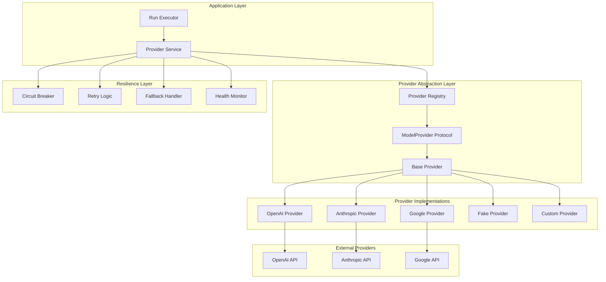

### Provider Protocol Definition

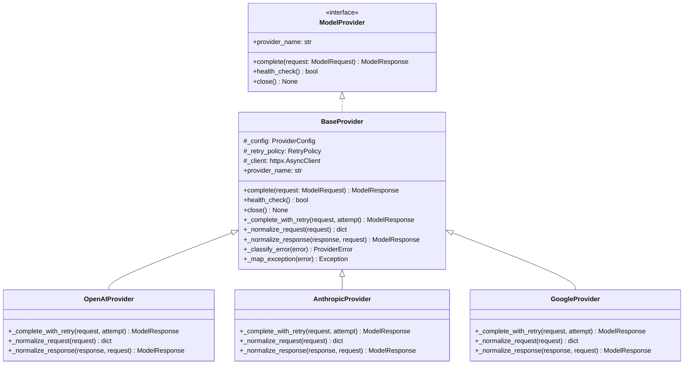

## Provider Configuration

### Provider Configuration Structure

```python
@dataclass
class ProviderConfig:
    """Provider configuration."""
    provider: str
    base_url: str | None = None
    api_key: str | None = None
    timeout_seconds: int = 30
    connect_timeout_seconds: int = 10
    max_retries: int = 3
    model: str = "gpt-4o"
    organization: str | None = None
```

### Provider Registry

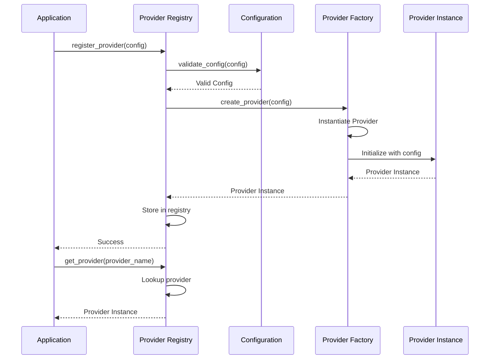

### Supported Providers

| Provider | Models | Status | Features |
|----------|--------|--------|----------|
| **OpenAI** | GPT-4o, GPT-4o-mini, G-4-turbo | ✅ GA | Streaming, function calling, vision |
| **Anthropic** | Claude 3.5 Sonnet, Claude 3 Haiku | ✅ GA | Streaming, extended context |
| **Google** | Gemini 1.5 Pro, Gemini 1.5 Flash | 🔄 Beta | Streaming, multimodal |
| **Fake** | Mock models | ✅ GA | Testing, development |
| **Custom** | OpenAI-compatible APIs | 🔧 DIY | Custom endpoints |

## Circuit Breaker Pattern

### Circuit Breaker State Machine

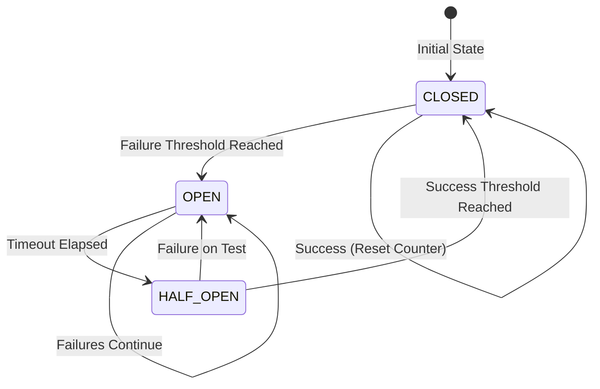

### Circuit Breaker Configuration

```python
@dataclass
class CircuitBreakerConfig:
    """Circuit breaker configuration."""
    failure_threshold: int = 5
    success_threshold: int = 2
    timeout_seconds: int = 60
    half_open_max_calls: int = 3
    monitor_window_seconds: int = 120
```

### Circuit Breaker Implementation

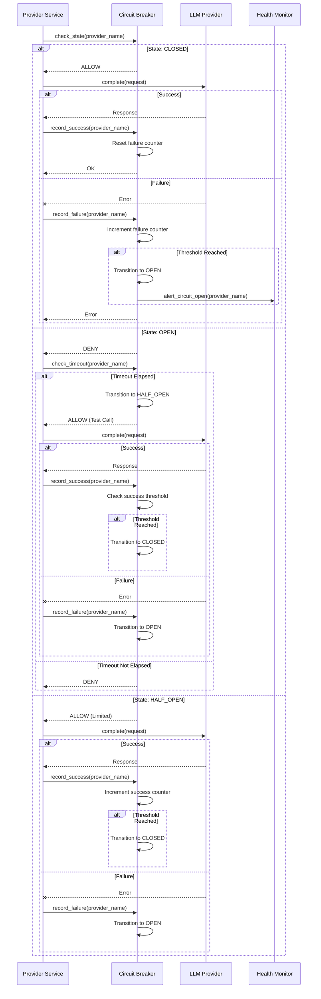

## Retry Logic

### Retry Strategy

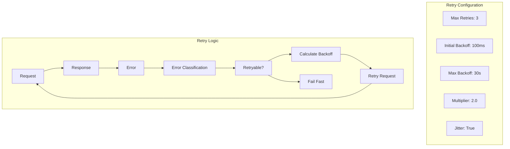

### Retry Policy Configuration

```python
@dataclass
class RetryPolicy:
    """Retry policy configuration."""
    max_retries: int = 3
    initial_backoff_ms: int = 100
    max_backoff_ms: int = 30000
    backoff_multiplier: float = 2.0
    jitter: bool = True
    retryable_exceptions: list[type] = field(default_factory=list)
```

### Exponential Backoff with Jitter

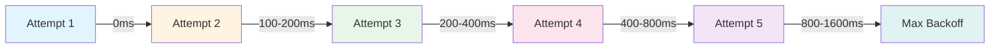

### Error Classification

| Error Type | Retryable | Circuit Impact | Example |
|------------|-----------|----------------|---------|
| **Timeout** | Yes | Minor Failure | Request timeout |
| **Rate Limit** | Yes | Minor Failure | 429 Too Many Requests |
| **Server Error** | Yes | Minor Failure | 500 Internal Server Error |
| **Connection Error** | Yes | Minor Failure | Connection refused |
| **Auth Error** | No | Major Failure | 401 Unauthorized |
| **Validation Error** | No | No Impact | 400 Bad Request |
| **Not Found** | No | No Impact | 404 Not Found |

## Fallback Mechanism

### Fallback Strategy

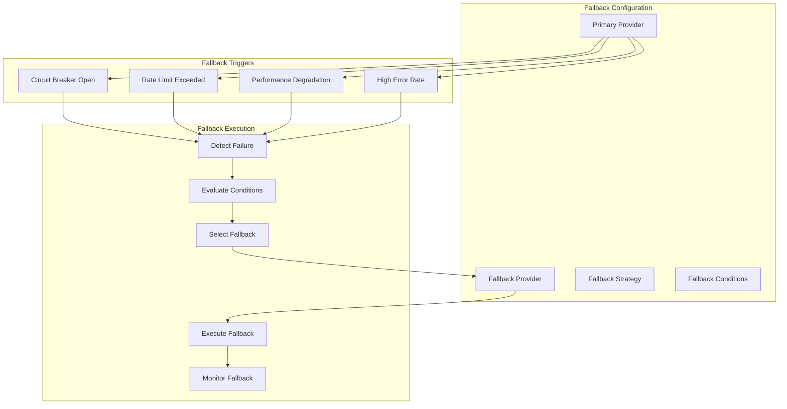

### Fallback Provider Selection

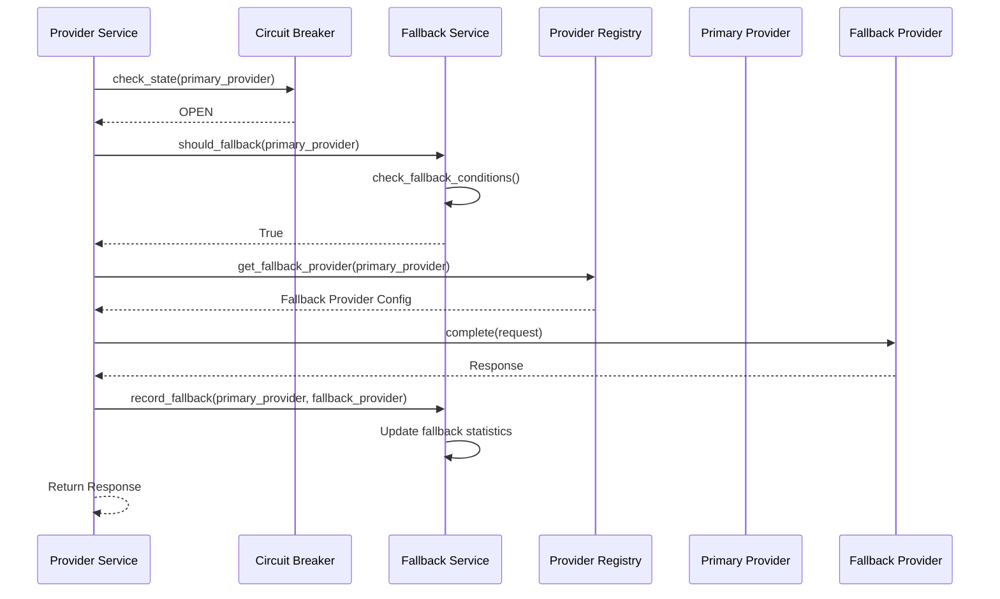

### Fallback Safety Checks

- **Capability Matching:** Ensure fallback provider supports required features
- **Model Compatibility:** Verify model capabilities are compatible
- **Cost Monitoring:** Track fallback costs to prevent runaway spending
- **Performance Monitoring:** Monitor fallback performance quality
- **Automatic Recovery:** Return to primary when healthy

## Health Monitoring

### Health Check Architecture

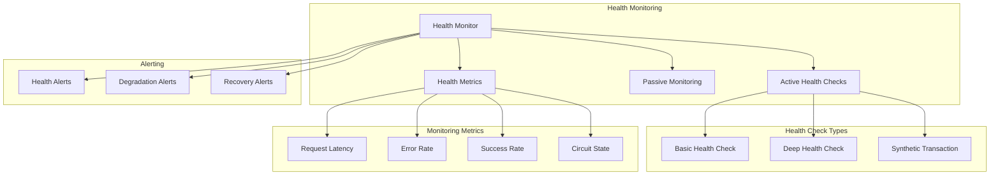

### Health Check Implementation

```python
class HealthMonitor:
    """Provider health monitoring."""
    
    async def check_provider_health(self, provider_name: str) -> HealthStatus:
        """Check provider health."""
        provider = self._registry.get_provider(provider_name)
        
        # Basic health check
        basic_healthy = await provider.health_check()
        
        # Deep health check (sample request)
        deep_healthy = await self._deep_health_check(provider)
        
        # Check circuit breaker state
        circuit_state = self._circuit_breaker.get_state(provider_name)
        
        # Calculate overall health
        health_status = HealthStatus(
            provider_name=provider_name,
            basic_healthy=basic_healthy,
            deep_healthy=deep_healthy,
            circuit_state=circuit_state,
            latency_ms=self._get_average_latency(provider_name),
            error_rate=self._get_error_rate(provider_name),
        )
        
        return health_status
```

### Health Status Metrics

| Metric | Healthy | Degraded | Unhealthy |
|--------|---------|----------|------------|
| **Latency** | <1000ms | 1000-5000ms | >5000ms |
| **Error Rate** | <5% | 5-20% | >20% |
| **Success Rate** | >95% | 80-95% | <80% |
| **Circuit State** | CLOSED | HALF_OPEN | OPEN |

## Usage Tracking

### Usage Collection Architecture

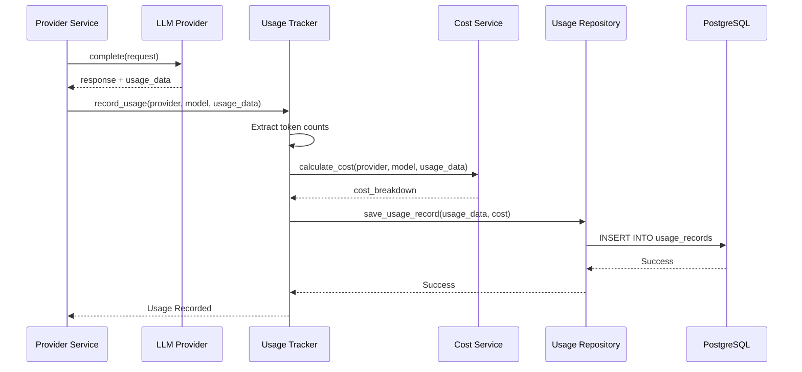

### Usage Data Structure

```python
@dataclass
class TokenUsage:
    """Token usage information."""
    prompt_tokens: int
    completion_tokens: int
    total_tokens: int
    
    def calculate_cost(self, provider: str, model: str) -> CostBreakdown:
        """Calculate cost based on provider pricing."""
        pricing = get_pricing(provider, model)
        prompt_cost = (self.prompt_tokens / 1000) * pricing.prompt_price
        completion_cost = (self.completion_tokens / 1000) * pricing.completion_price
        return CostBreakdown(
            prompt_cost=prompt_cost,
            completion_cost=completion_cost,
            total_cost=prompt_cost + completion_cost,
        )
```

### Cost Calculation

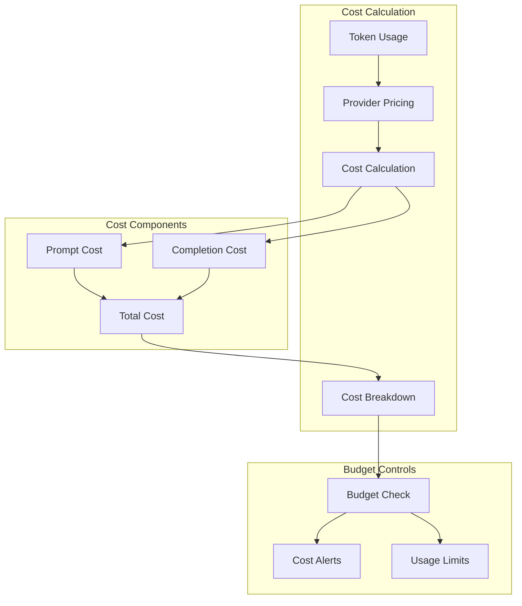

## Provider-Specific Implementations

### OpenAI Provider

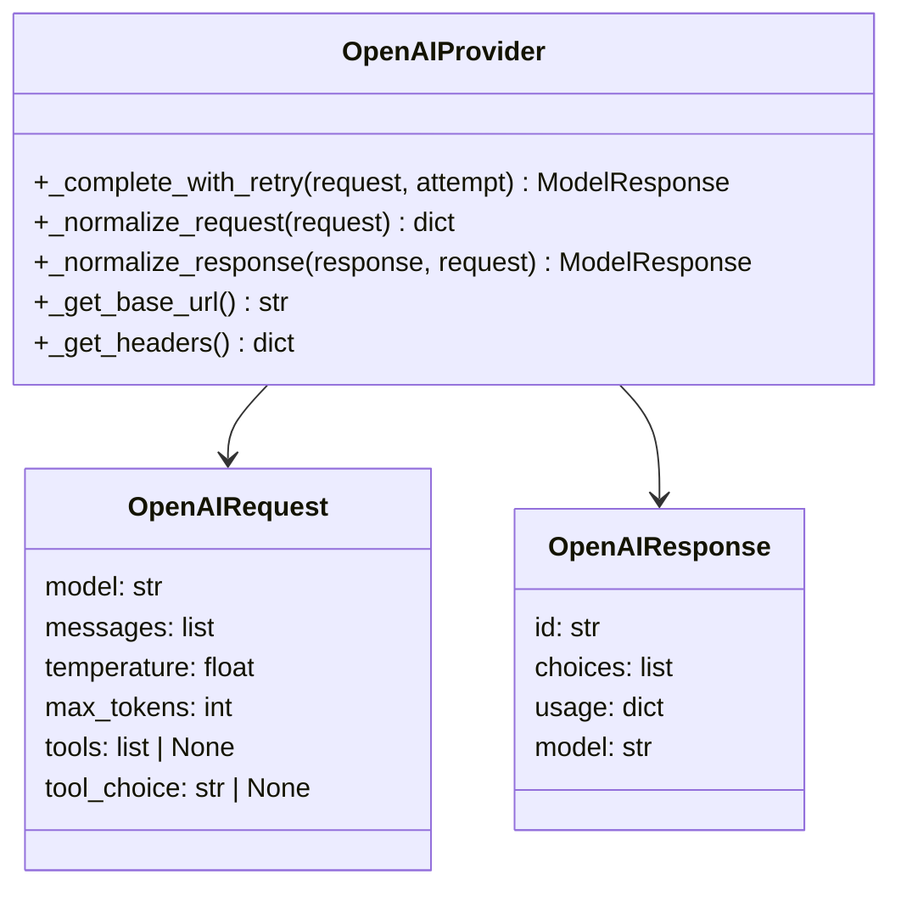

### Anthropic Provider

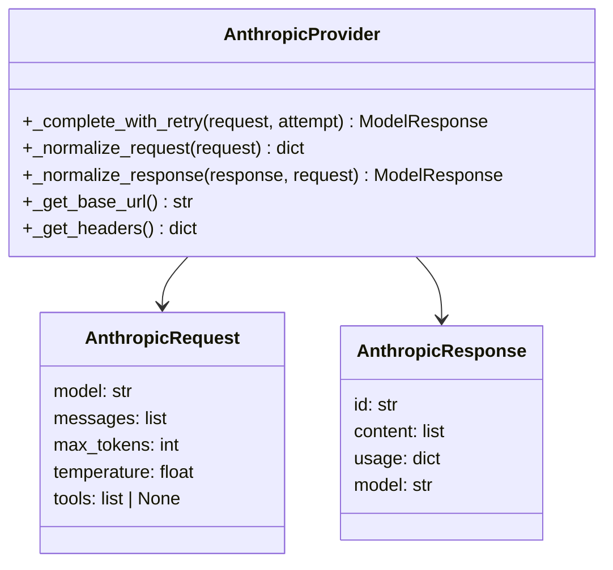

## Performance Optimization

### Connection Pooling

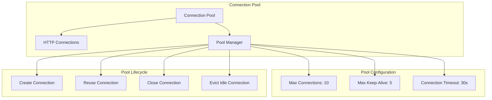

### Caching Strategy

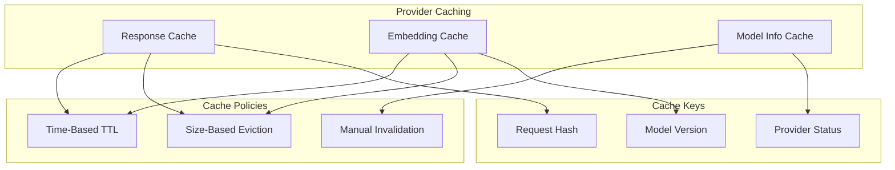

## Provider Configuration Examples

### OpenAI Configuration

```env
OPENAI_API_KEY=sk-proj-...
OPENAI_ORGANIZATION=org-...
OPENAI_MODEL=gpt-4o
OPENAI_TIMEOUT_SECONDS=30
OPENAI_MAX_RETRIES=3
OPENAI_CIRCUIT_BREAKER_ENABLED=true
```

### Anthropic Configuration

```env
ANTHROPIC_API_KEY=sk-ant-...
ANTHROPIC_MODEL=claude-3-5-sonnet-20241022
ANTHROPIC_TIMEOUT_SECONDS=30
ANTHROPIC_MAX_RETRIES=3
ANTHROPIC_CIRCUIT_BREAKER_ENABLED=true
```

### Fallback Configuration

```env
FALLBACK_ENABLED=true
FALLBACK_STRATEGY=performance
FALLBACK_PROVIDER=anthropic
FALLBACK_CONDITIONS=circuit_open,rate_limit,high_error_rate
FALLBACK_COST_LIMIT_MULTIPLIER=2.0
```

## Monitoring and Observability

### Provider Metrics

```mermaid
graph TB
    subgraph "Provider Metrics"
        REQUEST_METRICS[Request Metrics]
        PERFORMANCE_METRICS[Performance Metrics]
        RESILIENCE_METRICS[Resilience Metrics]
        COST_METRICS[Cost Metrics]
    end
    
    subgraph "Request Metrics"
        REQUEST_COUNT[Request Count]
        REQUEST_RATE[Request Rate]
        ERROR_COUNT[Error Count]
    end
    
    subgraph "Performance Metrics"
        LATENCY[P50, P95, P99 Latency]
        THROUGHPUT[Requests per Second]
        TIMEOUT_RATE[Timeout Rate]
    end
    
    subgraph "Resilience Metrics"
        CIRCUIT_STATE[Circuit State]
        RETRY_COUNT[Retry Count]
        FALLBACK_COUNT[Fallback Count]
    end
    
    subgraph "Cost Metrics"
        TOKEN_USAGE[Token Usage]
        COST_PER_REQUEST[Cost per Request]
        TOTAL_COST[Total Cost]
    end
    
    REQUEST_METRICS --> REQUEST_COUNT
    REQUEST_METRICS --> REQUEST_RATE
    REQUEST_METRICS --> ERROR_COUNT
    PERFORMANCE_METRICS --> LATENCY
    PERFORMANCE_METRICS --> THROUGHPUT
    PERFORMANCE_METRICS --> TIMEOUT_RATE
    RESILIENCE_METRICS --> CIRCUIT_STATE
    RESILIENCE_METRICS --> RETRY_COUNT
    RESILIENCE_METRICS --> FALLBACK_COUNT
    COST_METRICS --> TOKEN_USAGE
    COST_METRICS --> COST_PER_REQUEST
    COST_METRICS --> TOTAL_COST
```

This provider integration documentation provides comprehensive coverage of the multi-provider LLM integration architecture, including detailed implementation of circuit breaking, retry logic, fallback mechanisms, health monitoring, and usage tracking for the AIAgentX system.