# AIAgentX Security Architecture

## Overview

AIAgentX implements a comprehensive security architecture designed for multi-tenant enterprise environments. The system provides defense-in-depth security through multiple layers of protection, including authentication, authorization, data encryption, audit logging, and runtime security controls.

## Security Architecture Diagram

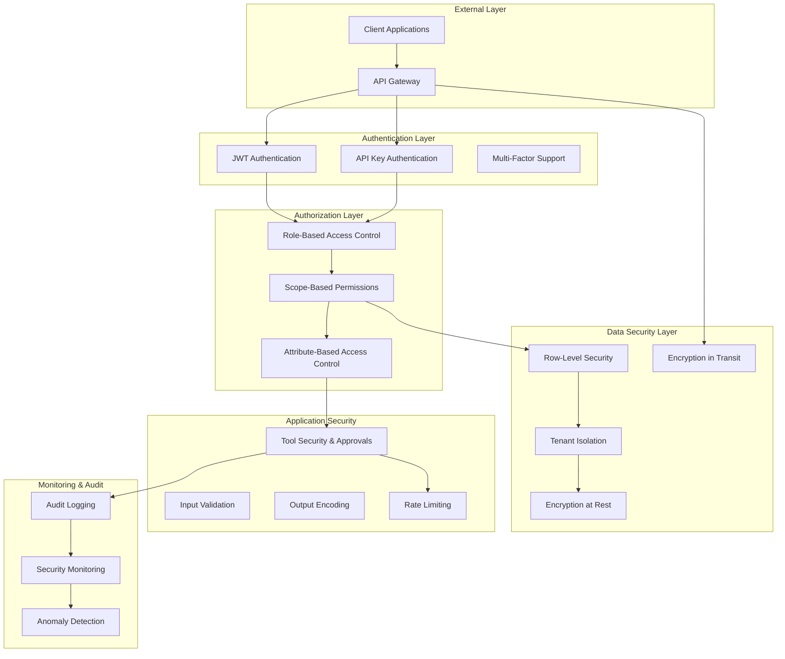

## Authentication Mechanisms

### JWT Authentication Flow

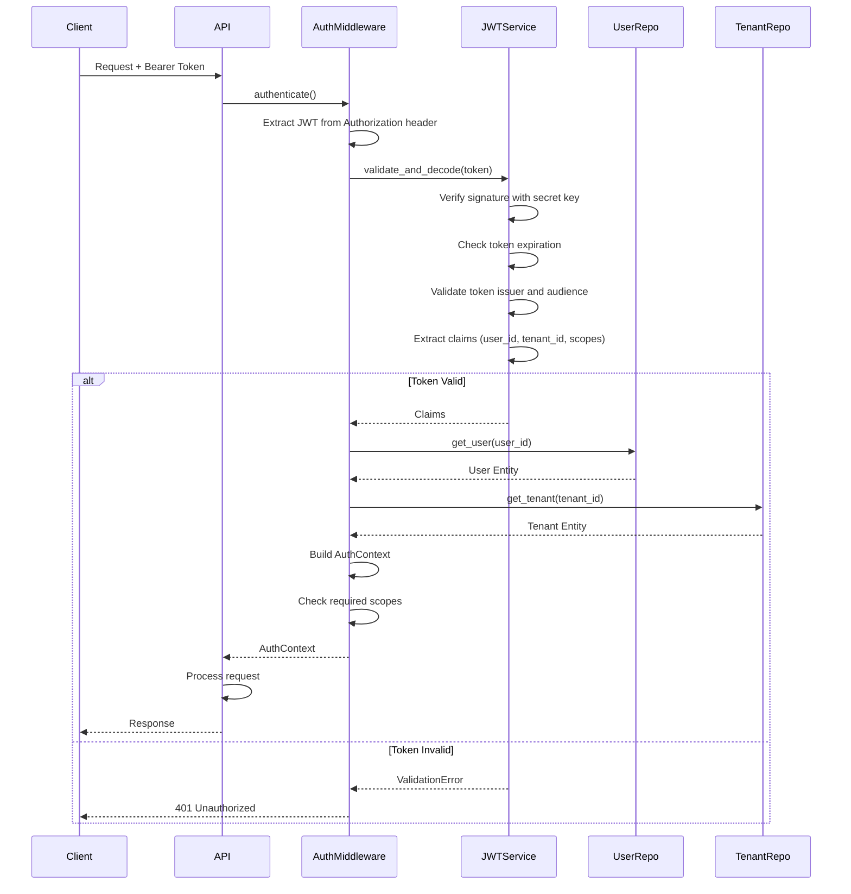

### JWT Token Structure

```json
{
  "header": {
    "alg": "RS256",
    "typ": "JWT",
    "kid": "key-id-1"
  },
  "payload": {
    "iss": "aiagentx",
    "sub": "user-id",
    "aud": "aiagentx-api",
    "exp": 1735689600,
    "iat": 1735686000,
    "tenant_id": "tenant-uuid",
    "user_id": "user-uuid",
    "scopes": ["agents:read", "agents:write", "runs:execute"],
    "token_type": "access"
  }
}
```

### API Key Authentication

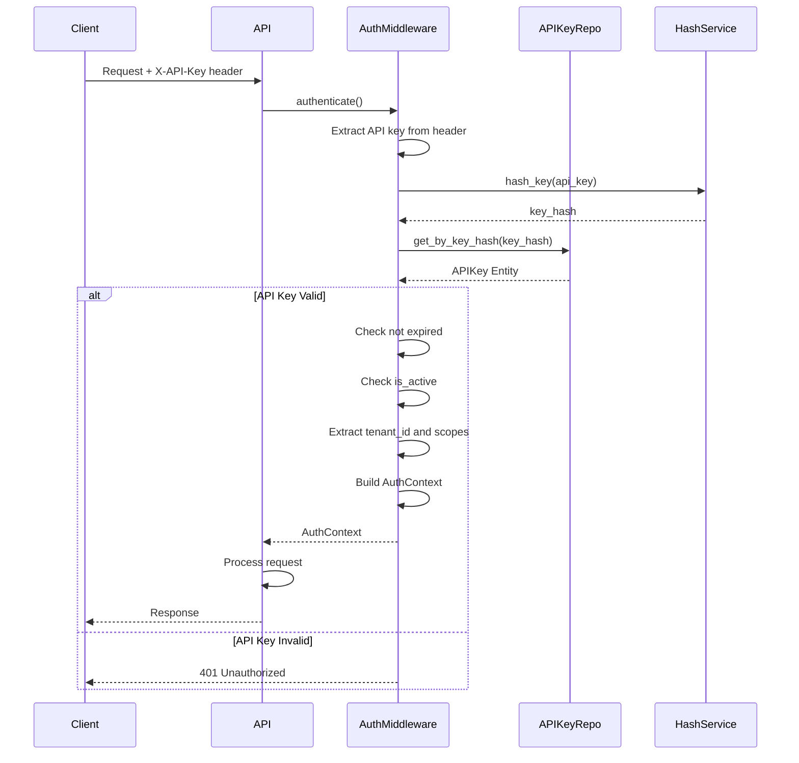

### API Key Security Features

- **Key Hashing:** API keys are hashed using SHA-256 before storage
- **Prefix-Based Identification:** Keys use prefixes (e.g., `aiak_`) for identification
- **Expiration:** Time-based expiration with configurable TTL
- **Scoping:** Keys can be restricted to specific scopes
- **Rate Limiting:** Per-key rate limiting to prevent abuse
- **Revocation:** Immediate revocation capability

## Authorization Model

### Scope-Based Access Control

AIAgentX implements a hierarchical scope system for fine-grained access control:

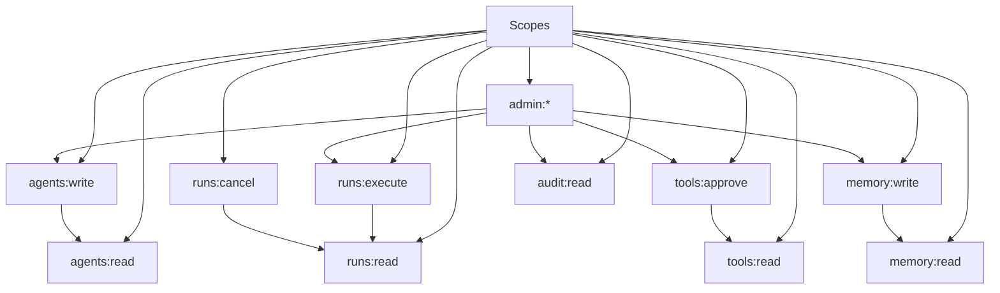

### Scope Definitions

| Scope | Description | Permissions |
|-------|-------------|-------------|
| `agents:read` | Read agent definitions | GET /agents, GET /agents/{id} |
| `agents:write` | Create/modify agents | POST /agents, PATCH /agents/{id}, DELETE /agents/{id} |
| `runs:read` | Read run information | GET /runs, GET /runs/{id} |
| `runs:execute` | Execute agent runs | POST /agents/{id}/runs |
| `runs:cancel` | Cancel running runs | POST /runs/{id}/cancel |
| `tools:read` | Read tool information | GET /tools |
| `tools:approve` | Approve tool executions | POST /approvals/{id}/approve |
| `memory:read` | Read memory data | GET /memory |
| `memory:write` | Write memory data | POST /memory |
| `audit:read` | Read audit logs | GET /audit |
| `admin:*` | Full administrative access | All permissions |

### Authorization Enforcement Points

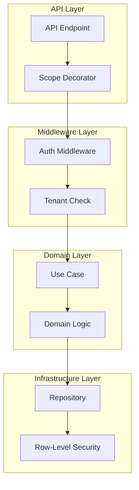

## Multi-Tenant Data Isolation

### Row-Level Security (RLS) Implementation

PostgreSQL Row-Level Security ensures tenant isolation at the database level:

```sql
-- Enable RLS on agents table
ALTER TABLE agents ENABLE ROW LEVEL SECURITY;

-- Create tenant isolation policy
CREATE POLICY tenant_isolation_agents ON agents
    FOR ALL
    TO aiagentx_app
    USING (
        tenant_id = current_setting('app.current_tenant_id')::uuid
    );

-- Apply similar policies to all tenant-scoped tables
CREATE POLICY tenant_isolation_runs ON runs
    FOR ALL
    TO aiagentx_app
    USING (
        tenant_id = current_setting('app.current_tenant_id')::uuid
    );

CREATE POLICY tenant_isolation_memory ON memory_records
    FOR ALL
    TO aiagentx_app
    USING (
        tenant_id = current_setting('app.current_tenant_id')::uuid
    );
```

### Tenant Context Propagation

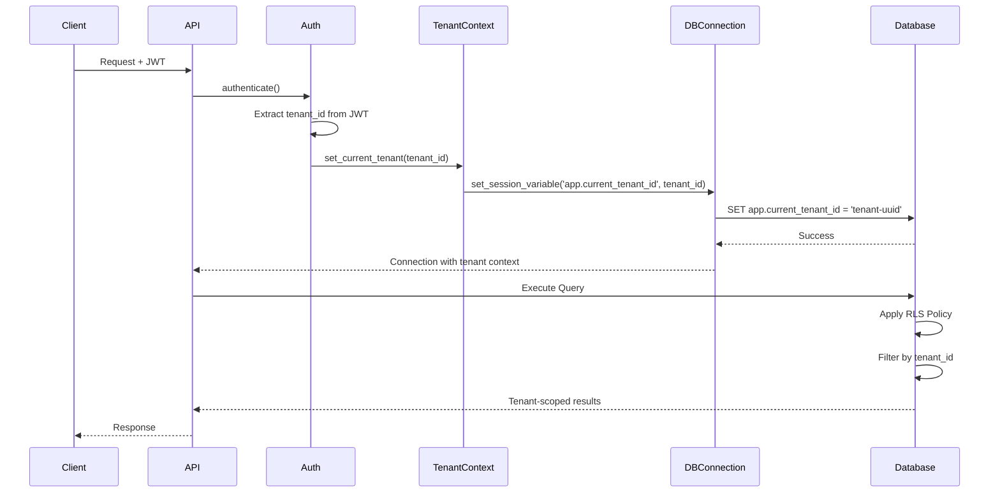

### Tenant Data Separation Strategy

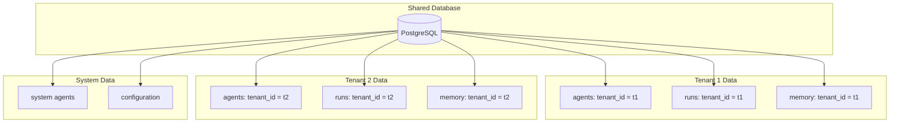

## Tool Security System

### Tool Policy Evaluation

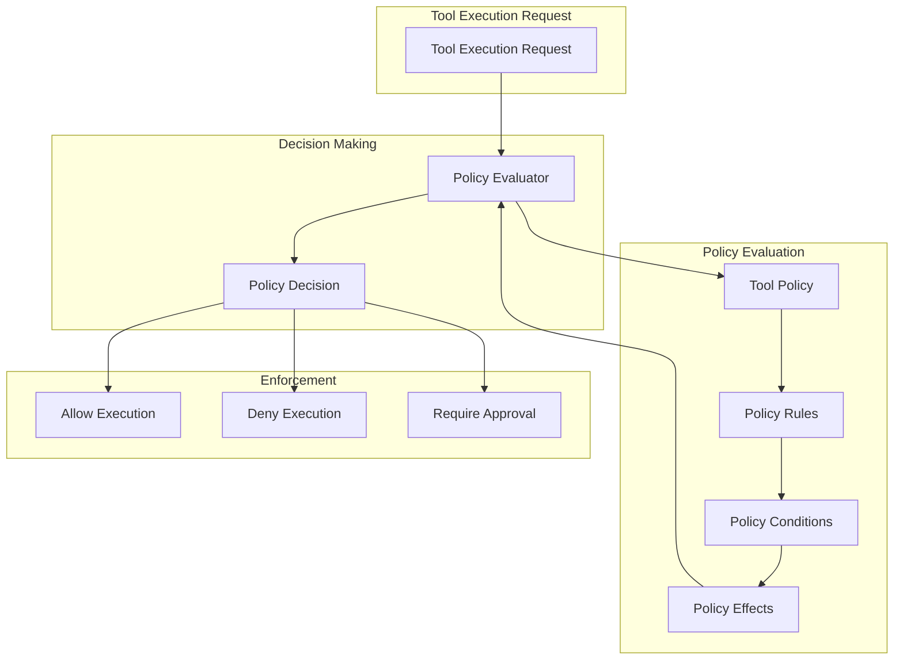

### Tool Approval Workflow

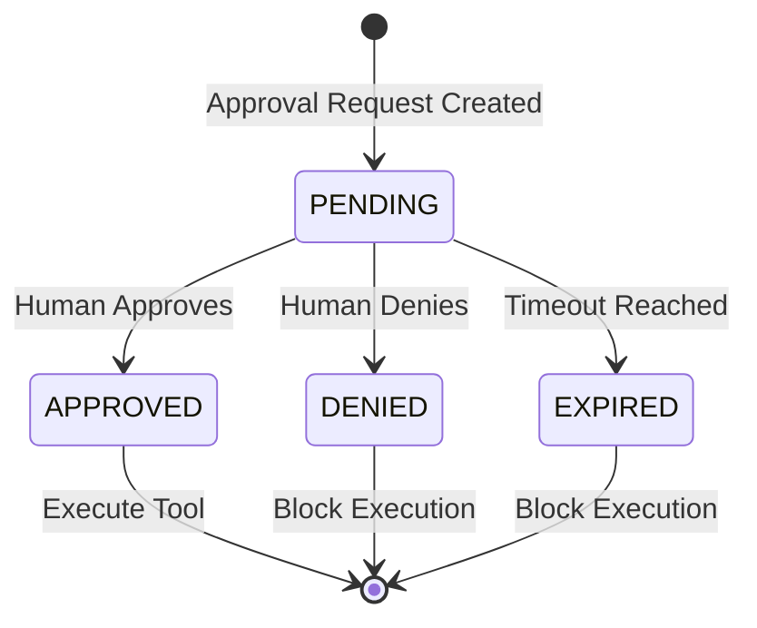

### Tool Classification System

Tools are classified based on their potential impact:

| Classification | Description | Default Behavior | Approval Required |
|---------------|-------------|------------------|-------------------|
| **Safe** | Read-only operations, no side effects | Auto-approve | No |
| **Destructive** | Write/delete operations with side effects | Manual review | Yes |
| **External** | Calls to external systems/APIs | Policy-based | Conditional |
| **Sensitive** | Access to sensitive data or systems | Strict policy | Always |
| **Financial** | Operations with financial impact | Strict policy | Always |

### Tool Policy Example

```json
{
  "tool_name": "database_delete",
  "classification": "destructive",
  "rules": [
    {
      "type": "allow",
      "condition": {
        "action": "delete",
        "resource": "temp_tables"
      },
      "effect": {
        "allow": true
      },
      "priority": 10
    },
    {
      "type": "deny",
      "condition": {
        "action": "delete",
        "resource": "production_tables"
      },
      "effect": {
        "allow": false
      },
      "priority": 100
    }
  ],
  "default_effect": {
    "allow": false,
    "require_approval": true
  },
  "metadata": {
    "description": "Database deletion tool",
    "risk_level": "high",
    "approval_timeout_seconds": 300
  }
}
```

## Data Encryption

### Encryption at Rest

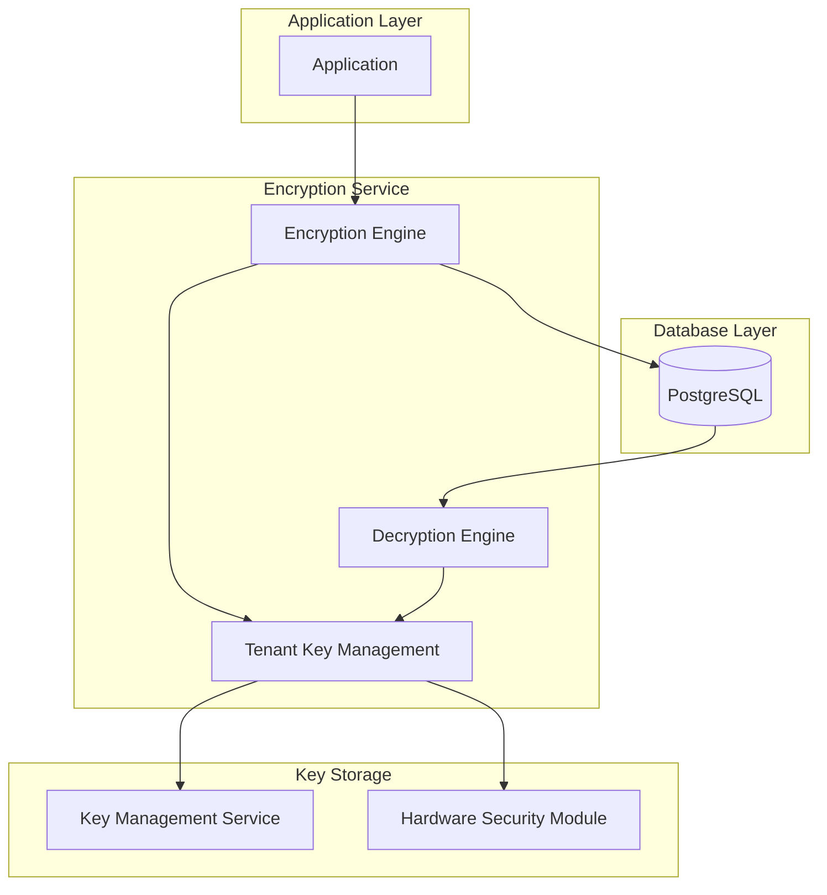

### Encryption Implementation

- **Algorithm:** AES-256-GCM for data encryption
- **Key Management:** Tenant-specific encryption keys
- **Key Storage:** Hardware Security Module (HSM) or KMS
- **Key Rotation:** Automatic key rotation policies
- **Data Classification:** Encrypt based on sensitivity level

### Encryption in Transit

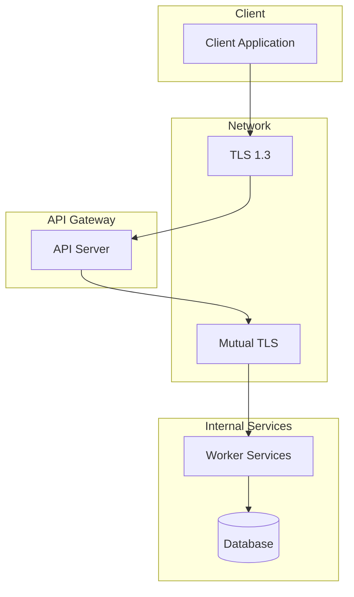

### TLS Configuration

- **Protocol:** TLS 1.3 minimum
- **Cipher Suites:** Modern, secure cipher suites only
- **Certificate Validation:** Strict certificate validation
- **HSTS:** HTTP Strict Transport Security enabled
- **Certificate Rotation:** Automated certificate management

## Audit Logging

### Audit Event Schema

```json
{
  "event_id": "uuid",
  "event_type": "tool_execution",
  "timestamp": "2024-01-01T00:00:00Z",
  "tenant_id": "tenant-uuid",
  "user_id": "user-uuid",
  "actor": {
    "type": "user",
    "id": "user-uuid",
    "ip_address": "192.168.1.1",
    "user_agent": "Mozilla/5.0..."
  },
  "resource": {
    "type": "tool",
    "id": "tool-name",
    "details": {...}
  },
  "action": "execute",
  "outcome": "success",
  "metadata": {
    "run_id": "run-uuid",
    "agent_id": "agent-uuid",
    "execution_time_ms": 150
  }
}
```

### Audit Event Types

| Event Type | Description | Criticality |
|------------|-------------|-------------|
| `authentication` | Login/logout events | High |
| `authorization` | Permission checks | Medium |
| `agent_creation` | Agent creation/modification | Medium |
| `agent_execution` | Agent run execution | High |
| `tool_execution` | Tool execution attempts | Critical |
| `data_access` | Data read/write operations | High |
| `configuration_change` | System configuration changes | Critical |
| `security_event` | Security-related events | Critical |

### Audit Data Flow

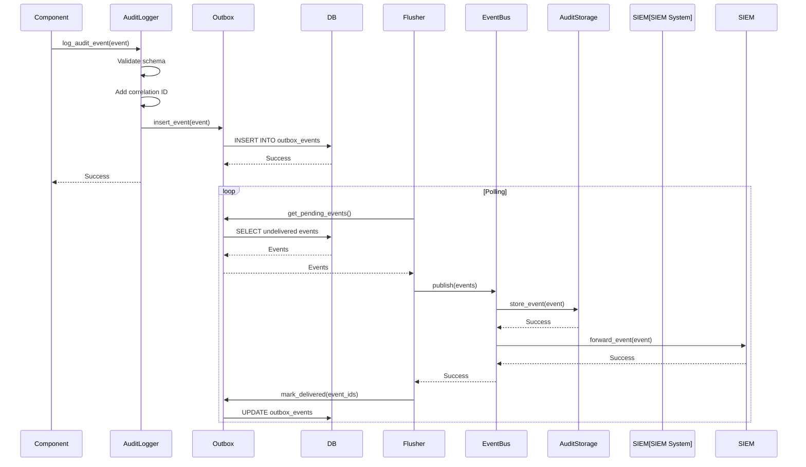

## Rate Limiting and Abuse Prevention

### Rate Limiting Strategy

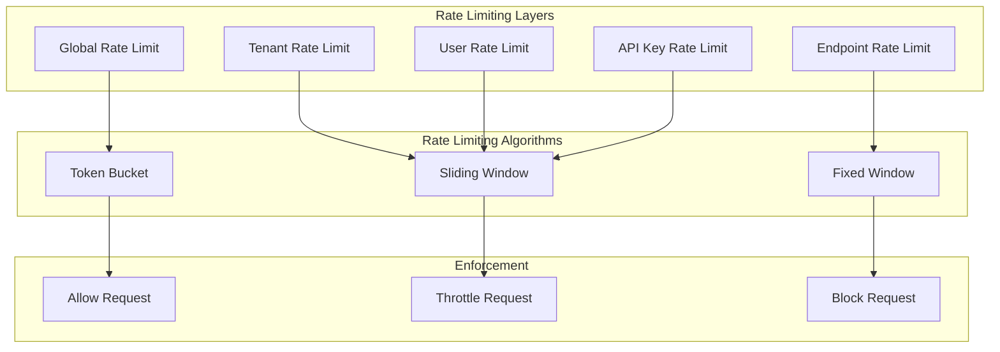

### Rate Limiting Configuration

| Scope | Limit | Window | Algorithm |
|-------|-------|--------|-----------|
| Global | 10,000 req/min | 1 minute | Token Bucket |
| Per Tenant | 1,000 req/min | 1 minute | Sliding Window |
| Per User | 100 req/min | 1 minute | Sliding Window |
| Per API Key | 200 req/min | 1 minute | Sliding Window |
| Per Endpoint | 50 req/min | 1 minute | Fixed Window |

### Abuse Detection

- **Pattern Recognition:** Detect unusual usage patterns
- **Geolocation Analysis:** Monitor geographic distribution
- **Behavioral Analysis:** Detect anomalous behavior
- **Velocity Checks:** Detect rapid-fire requests
- **IP Reputation:** Check IP reputation scores

## Input Validation and Output Encoding

### Input Validation Layers

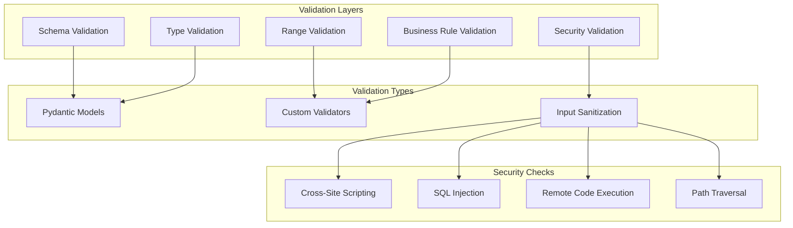

### Output Encoding

- **HTML Encoding:** Prevent XSS in HTML responses
- **JSON Encoding:** Proper JSON serialization
- **URL Encoding:** Safe URL parameter handling
- **SQL Parameterization:** Prevent SQL injection
- **Command Sanitization:** Prevent command injection

## Security Monitoring

### Security Metrics

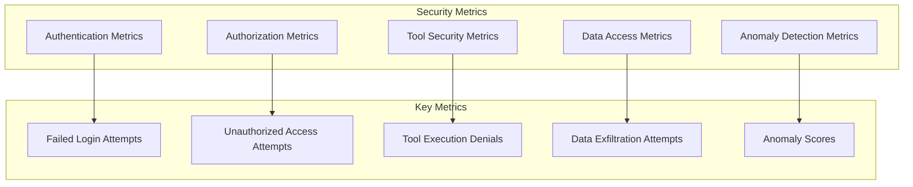

### Security Alerting

| Alert Type | Threshold | Response Time |
|------------|-----------|---------------|
| Failed Login Attempts | > 10 per minute | Immediate |
| Unauthorized Access | > 5 per minute | 5 minutes |
| Tool Execution Denials | > 3 per minute | 10 minutes |
| Data Exfiltration Attempts | Any | Immediate |
| Anomaly Score High | > 0.8 | 5 minutes |
| Rate Limit Exceeded | > 90% of limit | 1 minute |

## Compliance and Governance

### Data Protection Compliance

- **GDPR:** Data subject rights, consent management, data portability
- **SOC 2:** Security controls, access management, monitoring
- **HIPAA:** Healthcare data protection, audit trails
- **PCI DSS:** Payment card data handling, encryption

### Security Best Practices

1. **Principle of Least Privilege:** Minimal required permissions
2. **Defense in Depth:** Multiple security layers
3. **Fail Securely:** Secure by default, deny by default
4. **Secure by Design:** Security built into architecture
5. **Continuous Monitoring:** Real-time security monitoring
6. **Regular Audits:** Periodic security assessments
7. **Incident Response:** Established incident response procedures
8. **Security Training:** Regular security awareness training

## Security Configuration

### Environment Variables

```env
# Security Configuration
SECRET_KEY=your-secret-key-here
JWT_SECRET_KEY=your-jwt-secret-key
JWT_ALGORITHM=RS256
JWT_EXPIRATION_MINUTES=60

# Encryption
ENCRYPTION_KEY_ID=key-id-1
KMS_ENDPOINT=https://kms.example.com
HSM_ENABLED=true

# Rate Limiting
RATE_LIMIT_ENABLED=true
RATE_LIMIT_GLOBAL=10000
RATE_LIMIT_TENANT=1000
RATE_LIMIT_USER=100

# Security Headers
SECURE_HEADERS_ENABLED=true
HSTS_ENABLED=true
CSP_ENABLED=true

# Audit Logging
AUDIT_LOGGING_ENABLED=true
AUDIT_RETENTION_DAYS=90
AUDIT_FORWARD_TO_SIEM=true
```

This security architecture documentation provides a comprehensive overview of all security mechanisms in AIAgentX, ensuring enterprise-grade security for multi-tenant AI agent orchestration.